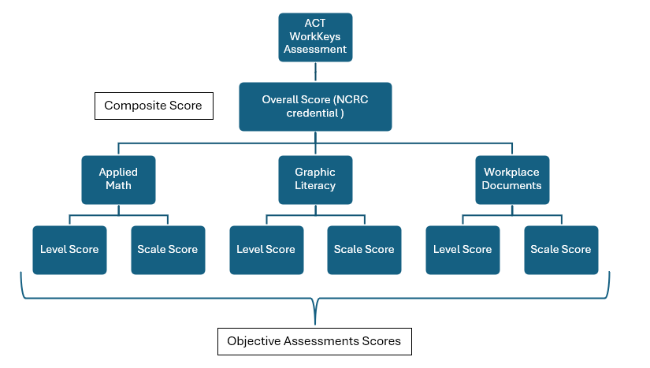

# ACTWorkKeys Assessment Bundle Documentation

# Assessments
## Assessments Identifiers
- Each ACTWorkKeys assessment component is mapped to a unique Assessment file.
- Assessment Identifiers:
  - WorkKeys Applied Math
  - WorkKeys Graphic Literacy
  - WorkKeys Workplace Documents

## Assessment Family
ACTWorkKeys

## Assessments Score Method Descriptors
For each assessment there will be two score method descriptors:
 - Level Score
 - Scale Score
  
  
# Hierarchy

## Reasoning
The ACT WorkKeys Assessment is administered to measure foundational career readiness skills that are essential across a wide range of occupations. The purpose of this assessment is to evaluate students' applied knowledge in real-world scenarios.

This assessment supports instructional and accountability goals by providing reliable, standardized data that informs educational planning, workforce alignment, and credentialing decisions. The results can be used to help students identify career pathways, assist educators in tailoring instruction, and help employers evaluate workforce preparedness.

This bundle processes ACT WorkKeys assessment data, transforming it into Ed-Fi compatible assessment and student assessment records. The bundle handles multiple ACTWorkKeys assessments including Applied Math, Workplace Documents and Graphic Literacy.

# Data Sources

## Input Requirements
- Primary source file containing student ACTWorkKeys assessment data with the following required columns:
  - Examinee ID: student unique identifier.
  - Test Date: assessment administration date
  - Manifest Name: assessment identifier
  - For each assessment, there are two columns with the scores:
    - Level Score 
    - Scale Score

## Bundle Seeds
- academicSubjectDescriptors.csv: Contains academic subject descriptors
- assessments.csv: Contains assessment metadata
- assessmentReportingMethodDescriptors.csv: Contains assessment reporting methods
- assessmentCategoryDescriptors.csv: Contains category descriptors
- gradeLevelMapping.csv: Contains grade level descriptors

# Ed-Fi Mapping
This bundle produces the following Ed-Fi resources:

## StudentAssessments
- studentAssessmentIdentifier: Generated using MD5 hash of assessmentIdentifier, studentUniqueId, and assessment date
- administrationDate: Mapped from testdate
- schoolYear: Mapped from testdate
- studentReference: Mapped from stateid
- scoreResults:
  - assessmentReportingMethodDescriptor: Mapped from descriptor source
  - resultDatatypeTypeDescriptor: Set to "Integer" for scale scores, and "Level" for level score
  - result: Mapped from corresponding assessment score column

## Summary of Descriptor Fields and Mappings

### academicSubjectDescriptor:
- Mathematics: **Namespace**: `uri://ed-fi.org/AcademicSubjectDescriptor#Mathematics`
- Literacy: **Namespace**: `uri://ed-fi.org/AcademicSubjectDescriptor#Literacy` (To be added?)
- Documents: **Namespace**: `uri://ed-fi.org/AcademicSubjectDescriptor#Documents` (To be added?)

### gradeLevelDescriptor: 
The documentation has 2 columns regarding education level, depending on the value of "WorkKeys Source" there will be these possible values:
- If testing method is WKPP (WorkKeys Paper and Pencil), they should be one of them: 
  - 1 = 7th Grade
  - 2 = 8th Grade   
  - 3 = 9th Grade   
  - 4 = 10th Grade  
  - 5 = 11th Grade  
  - 6 = 12th Grade
  - 7 = H.S. Grad.
  - 8 = GED
  - 9 = Other Secondary
  - 10 = 1st Year Postsecondary
  - 11 = 2nd Year Postsecondary
  - 12 = 3rd Year Postsecondary
  - 13 = 4th Year Postsecondary
  - 14 = 5th Year or Higher Post.
  - 15 = Other Postsecondary
  
- If testing method is WKIV (WorkKeys Internet Version (Online)), they should be one of them: 
  - 8th Grade or below
  - 9th Grade
  - 10th Grade
  - 11th Grade
  - 12th Grade
  - Dual enrollment-11th grade & college
  - Dual enrollment-12th grade & college
  - Trade/Proprietary school
  - Community College
  - Postsecondary-4-Year Institutions: Freshman
  - Postsecondary-4-Year Institutions: Sophomore
  - Postsecondary-4-Year Institutions: Junior
  - Postsecondary-4-Year Institutions: Senior
  - Postsecondary-4-Year Institutions: Postgraduate

### assessmentCategoryDescriptor:
- **Namespace**: `uri://act.org/AssessmentCategoryDescriptor#HS_CAREER_COLLEGE`

### assessmentReportingMethodDescriptor:
- **Namespace**: `uri://act.org/AssessmentReportingMethodDescriptor#Scale Score`
- **Namespace**: `uri://act.org/AssessmentReportingMethodDescriptor#Level Score`

### resultDatatypeTypeDescriptor:
- **Namespace**: `uri://ed-fi.org/ResultDatatypeTypeDescriptor#Integer`
- **Namespace**: `uri://ed-fi.org/ResultDatatypeTypeDescriptor#Level`

### assessmentPlatformTypeDescriptors:
- **Namespace**: `uri://act.org/PlatformTypeDescriptor#WKPP`
- **Namespace**: `uri://act.org/PlatformTypeDescriptor#WKIV`

### accommodationDescriptors:
There are cases where the "Manifest Name" (assessment) has the text " - Text To Speech" next to the assessment's name.
- **Namespace**: `uri://act.org/accommodationDescriptors#Test administration accommodation`

# Output Files

- assessmentReportingMethodDescriptors.jsonl
- assessmentCategoryMethodDescriptors.jsonl
- assessments.jsonl
- studentAssessmentEducationOrganizationAssociations.jsonl
- student_assessments.jsonl
- assessmentPlatformTypeDescriptors.jsonl

# Dependencies
- Requires Earthmover version 0.3.8 or higher
- Requires template files:
  - ./templates/assessments.jsont
  - ./templates/descriptors.jsont
  - ./templates/studentAssessments.jsont
  - ./templates/studentAssessmentEducationOrganizationAssociations.jsont

