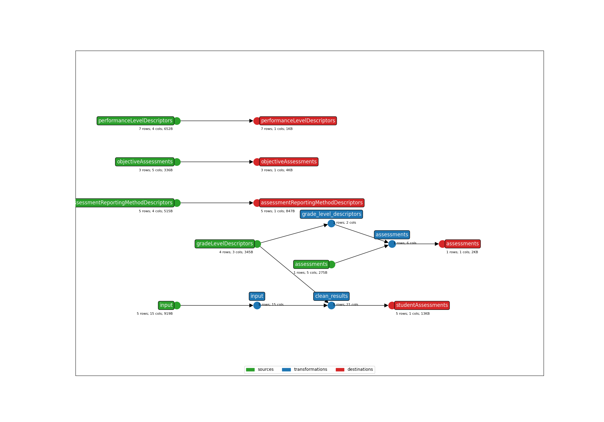

This is an earthmover bundle created from the following Ed-Fi Data Import Tool mapping:
* **Title**: California Educator Reporting System (CERS) Assessment Results - API 3.X
* **Description**: This template maps file-based assessment results from CERS
  District/School Exports.
* **Submitter name**: Greg Fitzgerald
* **Submitter organization**: Education Analytics

To run this bundle, please add your own source file(s):
* <code>data/cers__tenant__year.csv</code>

Or use the sample file (`data/sample_anonymized_file.csv`).

## CLI Parameters

### Required
- OUTPUT_DIR: Where output files will be written
- STATE_FILE: Where to store the earthmover runs.csv file
- INPUT_FILE: The CERS assessment results file to be mapped

### Examples
```bash
earthmover run -c earthmover.yaml -p '{
"INPUT_FILE": "data/sample_anonymized_file.csv",
"STATE_FILE": "./runs.csv",
"OUTPUT_DIR": "output/"
}'
```

Once you have inspected the output JSONL for issues, check the settings in `lightbeam.yaml` and transmit them to your Ed-Fi API with
```bash
lightbeam validate+send -c ./lightbeam.yaml -p '{
"DATA_DIR": "./output/",
"EDFI_API_BASE_URL": "yourURL",
"API_YEAR": "yourAPIYear",
"EDFI_API_CLIENT_ID": "yourID",
"EDFI_API_CLIENT_SECRET": "yourSecret" }'
```



(**Above**: a graphical depiction of the dataflow.)
