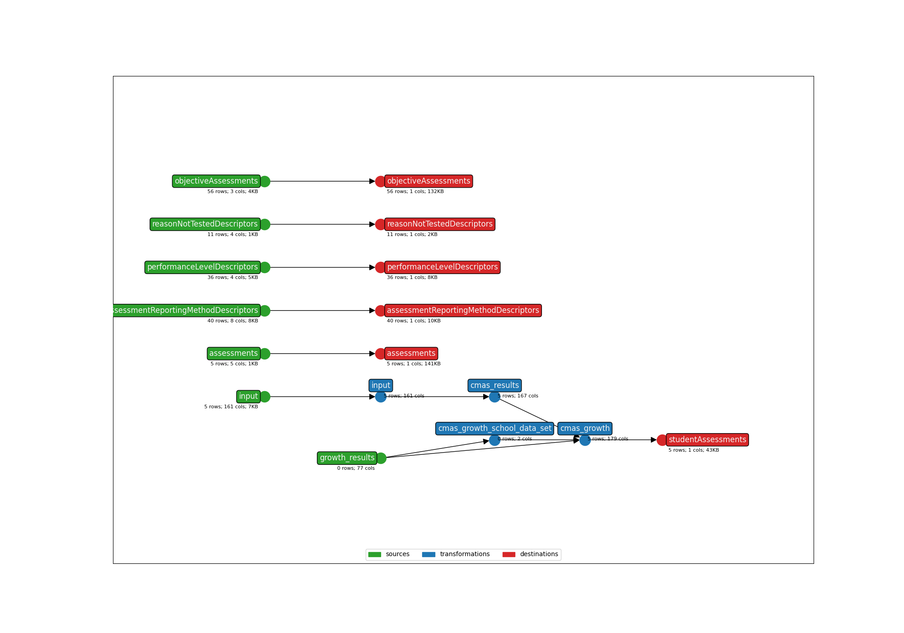

This is an earthmover bundle created from the following Ed-Fi Data Import Tool mapping:
* **Title**: Colorado Measures of Academic Success (CMAS) Assessment Results - API 3.X
* **Description**: This template includes the CMAS Mathematics, Science, English Language Arts/Literacy, and Spanish Language Arts/Literacy assessments. 
* **API version**: 5.3
* **Submitter name**: Sam LeBlanc
* **Submitter organization**: Education Analytics

To run this bundle, please add your own source file(s):
* <code>data/cmas_Student_Data_File.csv</code>
* (optional) <code>data/cmas_Growth_File.csv</code> 

Or use the sample file (`data/sample_anonymized_file.csv`).

## CLI Parameters

### Required
- OUTPUT_DIR: Where output files will be written
- STATE_FILE: Where to store the earthmover runs.csv file
- INPUT_FILE_CMAS_RESULTS: The CMAS assessment results file to be mapped
- STUDENT_ID_NAME: Which column to use as the Ed-Fi `studentUniqueId`. Default column is the 'Student Primary ID' from the DIBELS 8th Edition Benchmark file.
- SCHOOL_YEAR: The school year of the assessment file (structure of '2023' or '2024', etc).
- SCIENCE: Whether or not this is a science file (Options: "Y" or "N").
- ALTERNATE_ASSESSMENT: Whether or not this is an alternate file (Options: "Y" or "N").

### Optional
- INPUT_FILE_CMAS_GROWTH: The CMAS assessment growth results file to be mapped

### Examples
Using an ID column from the assessment file:
```bash
earthmover run -c earthmover.yaml -p '{
"INPUT_FILE_CMAS_RESULTS": "data/sample_anonymized_file.csv",
"STATE_FILE": "./runs.csv",
"OUTPUT_DIR": "output/",
"STUDENT_ID_NAME": "StateStudentIdentifier",
"SCHOOL_YEAR" : "2023",
"SCIENCE": "N",
"ALTERNATE_ASSESSMENT": "N" }'
```

Once you have inspected the output JSONL for issues, check the settings in `lightbeam.yaml` and transmit them to your Ed-Fi API with
```bash
lightbeam validate+send -c CMAS/lightbeam.yaml -p '{
"DATA_DIR": "./CMAS/output/",
"API_YEAR": "2023",
"EDFI_API_CLIENT_ID": "yourID",
"EDFI_API_CLIENT_SECRET": "yourSecret" }'
```



(**Above**: a graphical depiction of the dataflow.)