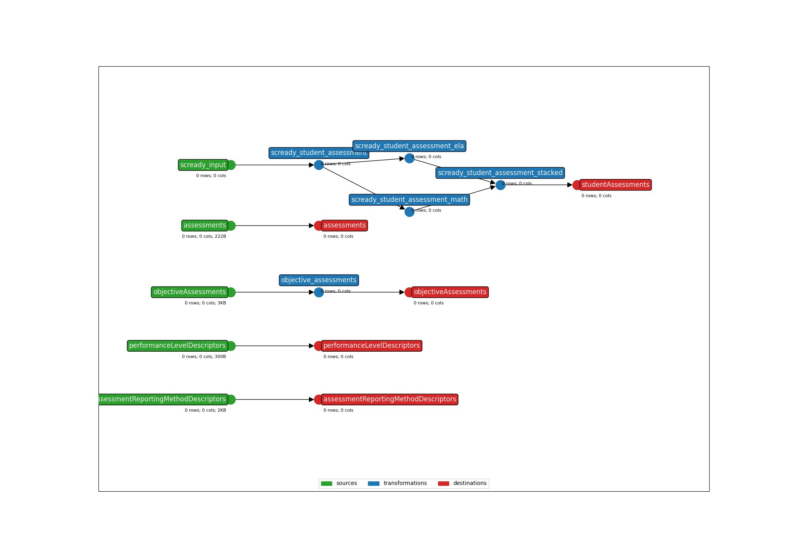

* **Title:** DRC SC READY Assessment Results - API 3.X
* **Description:** Data Recognition Corporation South Carolina College-and Career-Ready Assessment
* **API version:** 5.3
* **Submitter name:** Jay Kaiser
* **Submitter organization:** Education Analytics

To run this bundle, please add your own source file(s) and column(s):
<details>
<summary><code>data/SCREADY-data.csv</code></summary>

This template extracts a subset of columns from the state-delivered SC Ready file, as formatted in years 2021 and onward. Note that the schema of the flat file will vary before this year.

One unique feature of the SCDE-delivered flat files are the presence of state-IDs without the need for ID-xwalking. This aspect of Earthmover templating has been ignored in this bundle.

</details>


### Examples
The expected inputs when running this template:
```bash
earthmover run -c ./earthmover.yaml -p '{
"BUNDLE_DIR": ".",
"INPUT_FILE": "path/to/SCREADY-data.csv",
"OUTPUT_DIR": "./output",
"API_YEAR": "2024"}'
```

If using a non-standard filetype (e.g., Parquet):
```bash
earthmover run -c ./earthmover.yaml -p '{
"BUNDLE_DIR": ".",
"INPUT_FILE": "path/to/SCREADY-data.csv",
"INPUT_FILETYPE": "parquet",
"OUTPUT_DIR": "./output",
"API_YEAR": "2024"}'
```

Once you have inspected the output JSONL for issues, check the settings in `lightbeam.yaml` and transmit them to your Ed-Fi API with
```bash
lightbeam validate+send -c ./lightbeam.yaml -p '{
"DATA_DIR": "./output/",
"EDFI_API_BASE_URL": "yourURL",
"EDFI_API_CLIENT_ID": "yourID",
"EDFI_API_CLIENT_SECRET": "yourSecret",
"API_YEAR": "yourAPIYear" }'
```



(**Above**: a graphical depiction of the dataflow.)