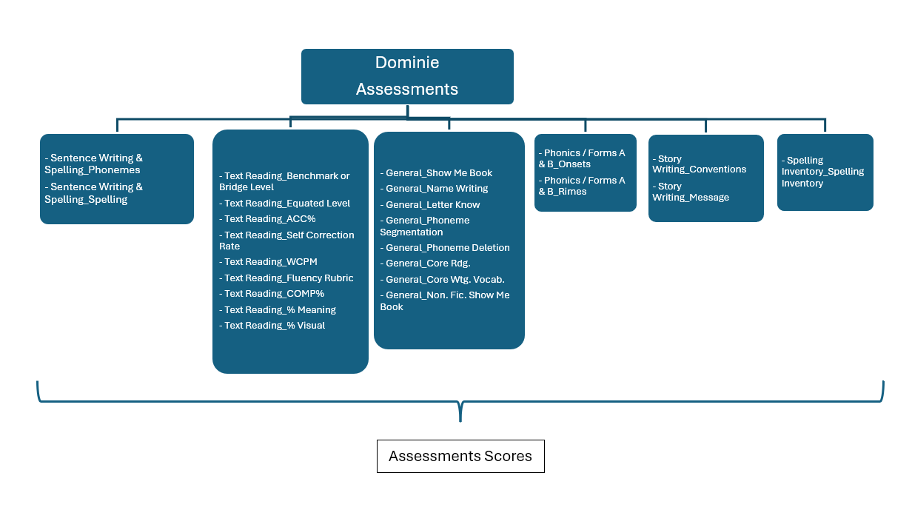

# Dominie Assessment Bundle Documentation

# Assessments
## Assessments Identifiers
Dominie

## Assessment Family
Dominie

## Objective Assessments
 - Phonemes
 - Spelling
 - Letter Knowledge
 - Phoneme Segmentation
 - Phoneme Deletion
 - Spelling Inventory
 - Benchmark or Bridge Level
 - Equated Level
 - Accuracy %
 - Comprehension %
 - Fluency Rubric
 - Words Correct Per Minute
 - Name Writing
 - Show Me a Book Fiction
 - Show Me a Book Nonfiction
 - Core Reading
 - Core Writing Vocabulary
 - Onsets
 - Rimes
 - Writing Conventions
 - Writing Message

## Assessments Score Method Descriptors
Each ObjectiveAssessment corresponds to a particular literacy skill. When multiple scoring methods are available for the same skill, such as a raw score and a stanine score, they are represented as separate score entries under the same ObjectiveAssessment.
 - Raw Score: string
 - Percent: decimal
 - Stanine: Standard nine-point scale scores for norm-referenced interpretation (integer)
 - Rubric?: decimal

# Hierarchy

## Reasoning
The Dominie Reading and Writing Assessment is designed to provide a comprehensive, formative evaluation of early literacy skills for students in kindergarten through third grade. Its purpose is to guide instruction and intervention by assessing foundational components of reading and writing, including phonemic awareness, phonics, fluency, comprehension, vocabulary, spelling, and writing conventions. The assessment’s portfolio-based format allows educators to capture individual student progress across multiple domains, inform instructional decisions, and support differentiated learning based on student needs.

# Data Sources

## Input Requirements
- Primary source file containing student Dominie assessment data with the following required columns:
  - Student unique identifier.
  - Assessment administration date
  - Objective assessment identifier
  - Score per objective.

## Bundle Seeds
- `assessments.csv`: Contains assessment metadata
- `assessmentReportingMethodDescriptors.csv`: Contains assessment reporting methods
- `assessmentCategoryDescriptors.csv`: Contains category descriptors
- `gradeLevelMapping.csv`: Grade level values by testing type
- `objectiveAssessments.csv`: Defines assessment objectives

# Ed-Fi Mapping
This bundle produces the following Ed-Fi resources:

## StudentAssessments
- studentAssessmentIdentifier: Generated using MD5 hash of assessmentIdentifier, studentUniqueId, and assessment date
- administrationDate: Mapped from datetaken
- schoolYear: Mapped from datetaken
- studentReference: Mapped from suns
- scoreResults:
  - assessmentReportingMethodDescriptor: Mapped from descriptor source
  - resultDatatypeTypeDescriptor
  - result: Mapped from corresponding objective assessment score column

## Summary of Descriptor Fields and Mappings

### gradeLevelDescriptor:
- Namespace: `uri://ed-fi.org/GradeLevelDescriptor`

### assessmentCategoryDescriptor:
- `uri://pearson.com/AssessmentCategoryDescriptor#Diagnostic`

### assessmentReportingMethodDescriptor:
 - Raw Score: `uri://pearson.com/AssessmentReportingMethodDescriptor#Raw Score`
 - Percent: `uri://pearson.com/AssessmentReportingMethodDescriptor#Percent`
 - Stanine: `uri://pearson.com/AssessmentReportingMethodDescriptor#Stanine`
 - Rubric: `uri://pearson.com/AssessmentReportingMethodDescriptor#Rubric` ???

# Output Files

- assessmentReportingMethodDescriptors.jsonl
- assessments.jsonl
- objectiveAssessments.jsonl
- studentAssessmentEducationOrganizationAssociations.jsonl
- studentAssessments.jsonl

# Dependencies
- Requires Earthmover version 0.3.8 or higher
- Requires template files:
  - ./templates/assessments.jsont
  - ./templates/objectiveAssessments.jsont
  - ./templates/descriptors.jsont
  - ./templates/studentAssessments.jsont
  - ./templates/studentAssessmentEducationOrganizationAssociations.jsont

