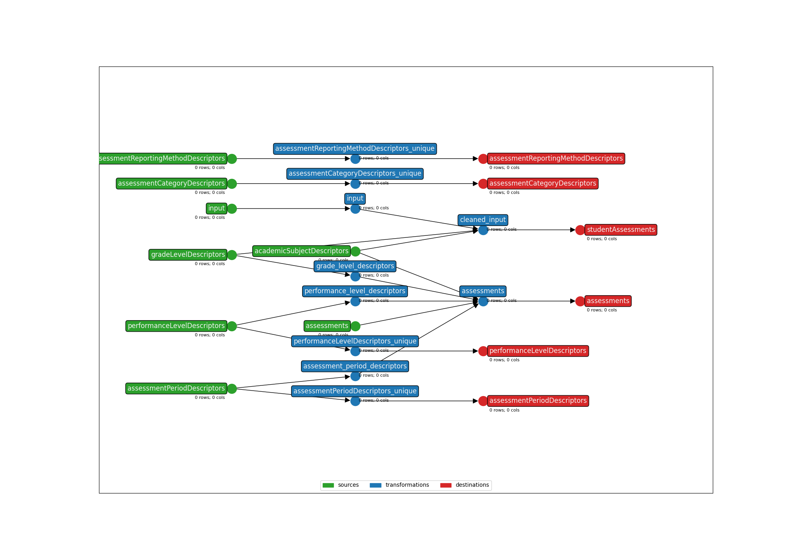

* **Title**: FastBridgeCAT
* **Description**: This is a template bundle that will map the FastBridge aMath and aReading assessments.
* **Submitter name**: Jacob Bortell
* **Submitter organization**: Education Analytics


## Running this bundle without Student ID Xwalking

To run this bundle without implementing the student ID xwalking packages:

```bash
# aMath
earthmover run -c ./earthmover.yaml -p '{
  "INPUT_FILE": "data/sample_anonymized_aMath.csv",
  "OUTPUT_DIR": "output/" ,
  "STUDENT_ID_NAME": "Local ID",
  "TEST_TYPE": "aMath"
}'
```

```bash
# aReading
earthmover run -c ./earthmover.yaml -p '{
  "INPUT_FILE": "data/sample_anonymized_aReading.csv",
  "OUTPUT_DIR": "output/" ,
  "STUDENT_ID_NAME": "Local ID",
  "TEST_TYPE": "aReading"
}'
```

## Lightbeam

Once you have inspected the output JSONL for issues, check the settings in `lightbeam.yaml` and transmit them to your Ed-Fi API with
```bash
lightbeam validate+send -c ./lightbeam.yaml -p '{
"DATA_DIR": "./output/",
"STATE_DIR": "./tmp/.lightbeam/",
"EDFI_API_BASE_URL": "<yourURL>",
"EDFI_API_CLIENT_ID": "<yourID>",
"EDFI_API_CLIENT_SECRET": "<yourSecret>",
"SCHOOL_YEAR": "<yourAPIYear>"}'
```

## DAG Graph


(**Above**: a graphical depiction of the dataflow.)