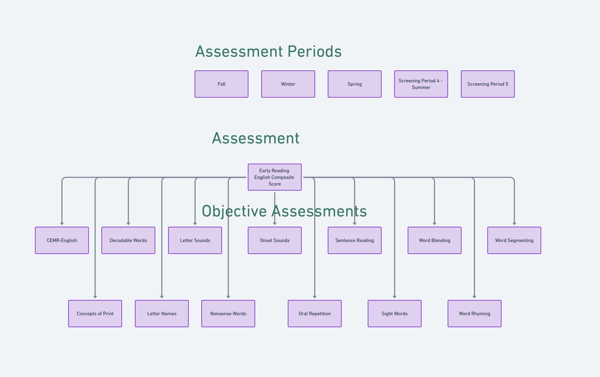

# FastBridge English Assessment Mapping

## Score Types for Assessment and Sub-Assessments

### Main Assessment Score Types
The FastBridge English assessment provides several score types for the overall assessment:

1. **Percentile at LEA** - Percentile ranking within the Local Education Agency (district)
2. **Percentile at Nation** - Percentile ranking compared to national norms
3. **Percentile at School** - Percentile ranking within the school
4. **Risk Level** - Risk categorization ( Low Risk, Some Risk, High Risk)

### Sub-Assessment Score Types
Each sub-assessment (component skill) within FastBridge English provides the same score types:

1. **Percentile at LEA** - Sub-assessment percentile ranking within the Local Education Agency
2. **Percentile at Nation** - Sub-assessment percentile ranking compared to national norms
3. **Percentile at School** - Sub-assessment percentile ranking within the school
4. **Risk Level** - Sub-assessment risk categorization

### Risk Level Categories (Performance Level)
Risk levels are typically categorized as:
- **Low Risk**: Student performing at or above expected levels
- **Some Risk**: Student showing some areas of concern
- **High Risk**: Student requiring intensive intervention

## 4 · Additional, Item-Level Fields
FASTBridge exports extra granular metrics—useful for diagnostic drilling, but can be safely excluded from the assessment mapping.

- **Error (Total Items − Items Correct)** – raw count
- **IC per minute** – items answered correctly per minute
- **Items Correct** – total correct responses
- **Total Items** – items presented

## 5 · Growth Metrics Breakdown
FASTBridge files also contain **150 + growth-derived columns**. These are calculated by comparing scores **between assessment windows** rather than within a single window, so they don’t map neatly onto any one period.

**Typical growth metrics (computed across Fall → Winter → Spring → Screening 4 → Screening 5):**

- District Growth Percentile
- Growth Percentile by Start Score
- Growth Score
- National Growth Percentile
- School Growth Percentile

Because they’re window-to-window deltas, they can be **safely excluded** from the mappings.

### Understanding Growth Metrics

#### Growth Score
- **Definition**: Simple arithmetic difference between two assessment scores for the same year
- **Calculation**: Later Score - Earlier Score
#### Growth Percentile
- **Definition**: Ranking of a student's growth relative to other students who had similar starting scores
- **Purpose**: Shows how well a student grew compared to academic peers

### More details # FASTBRIDGE ASSESSMENT FIELDS BREAKDOWN

## Demographic / Basic Fields
- Assessment
- Assessment Language
- DOB
- District
- FAST ID
- First Name
- Gender
- Grade
- Last Name
- Local ID
- Race
- School
- Special Ed. Status
- State
- State ID

## Assessment Periods
1. Fall
2. Winter
3. Spring
4. Screening Period&nbsp;4&nbsp;|&nbsp;Summer
5. Screening Period&nbsp;5

## Assessment Data Breakdown

### Shared Fields
- Final Date
- Percentile at LEA
- Percentile at Nation
- Percentile at School
- Risk Level

### Assessments

#### CBMR‑English
- Error (TWR ‑ WRC)
- Median Accuracy
- Total Words Read
- WRC per minute
- Words Read Correct

#### Concepts of Print
- Error (Total Items ‑ Items Correct)
- IC per minute
- Items Correct
- Total Items

#### Decodable Words
- Total Words Read
- WRC per minute
- Words Read Correct

#### Early Reading English
- Composite Score

#### Letter Names
- Total Words Read
- WRC per minute
- Words Read Correct

#### Letter Sounds
- Total Words Read
- WRC per minute
- Words Read Correct

#### Nonsense Words
- Total Words Read
- WRC per minute
- Words Read Correct

#### Onset Sounds
- Error (Total Items ‑ Items Correct)
- IC per minute
- Items Correct
- Total Items

#### Oral Repetition
- Error (Total Items ‑ Items Correct)
- IC per minute
- Items Correct
- Total Items

#### Sentence Reading
- Total Words Read
- WRC per minute
- Words Read Correct

#### Sight Words
- Total Words Read
- WRC per minute
- Words Read Correct

#### Word Blending
- Error (Total Items ‑ Items Correct)
- IC per minute
- Items Correct
- Total Items

#### Word Rhyming
- Error (Total Items ‑ Items Correct)
- IC per minute
- Items Correct
- Total Items

#### Word Segmentation
- Error (Total Items ‑ Items Correct)
- IC per minute
- Items Correct
- Total Items
