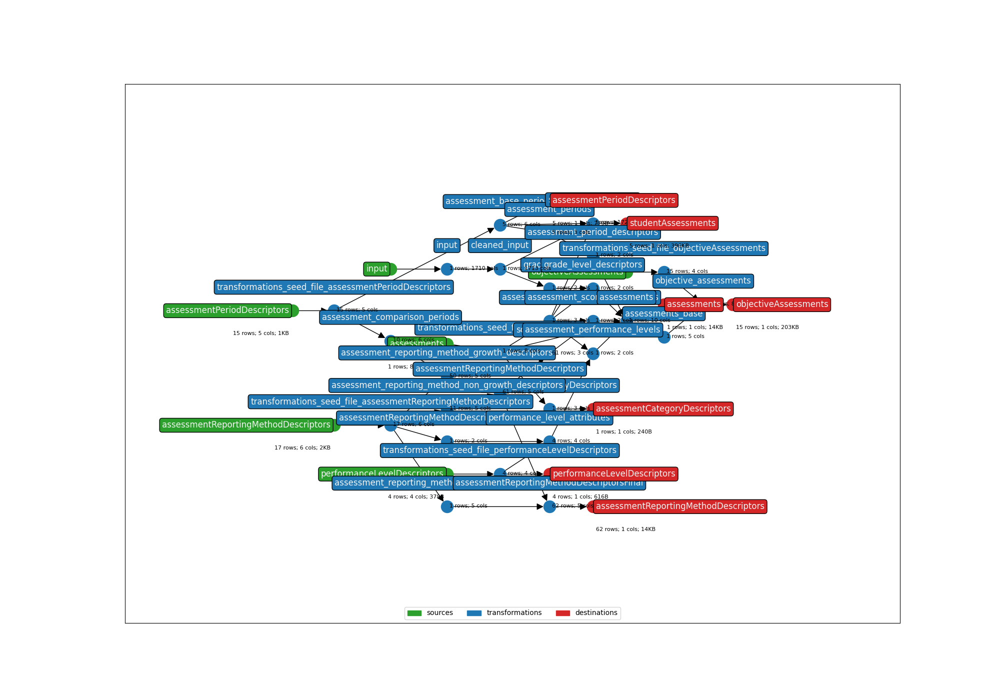

## FastBridge

* **Title:** FastBridge
* **Description:** Screening and progress monitoring assessments for English and Math
* **API version:** 5.3
* **Submitter name:** Shailendra Singh
* **Submitter organization:** Double Line Inc.

To run this bundle, please add your own source file(s) and column(s):
<details>
This template will work with vendor layout file structure. See the sample anonymized file.
</details>

Sample file: `data/sample_anonymized_file_earlyMath.csv`)

### CLI Parameters

### Required
- **OUTPUT_DIR**: Where output files will be written
- **STATE_FILE**: Where to store the earthmover runs.csv file
- **INPUT_FILE**: The student assessment file to be mapped
- **STUDENT_ID_NAME**: Which column to use as the Ed-Fi `studentUniqueId`. Default column is the 'StateID' from the vendor layour file.
- **SCHOOL_YEAR**: The year of the assessment file (format as 'YYYY' e.g. '2024', etc).

### Examples
Using an ID column from the assessment file:
```bash
earthmover run -c ./earthmover.yaml -p '{
"INPUT_FILE": "data/sample_anonymized_file_earlyMath.csv",
"STATE_FILE": "./tmp/runs.csv",
"OUTPUT_DIR": "output/",
"STUDENT_ID_NAME": "StateID",
"SCHOOL_YEAR": "2024"}'
```

Once you have inspected the output JSONL for issues, check the settings in `lightbeam.yaml` and transmit them to your Ed-Fi API with
```bash
lightbeam validate+send -c ./lightbeam.yaml -p '{
"DATA_DIR": "./output/",
"STATE_DIR"="./tmp/.lightbeam/"
"EDFI_API_BASE_URL": "<yourURL>",
"EDFI_API_CLIENT_ID": "<yourID>",
"EDFI_API_CLIENT_SECRET": "<yourSecret>",
"SCHOOL_YEAR": "<yourAPIYear>" }'
```
### Dataflow Graph



(**Above**: a graphical depiction of the dataflow.)