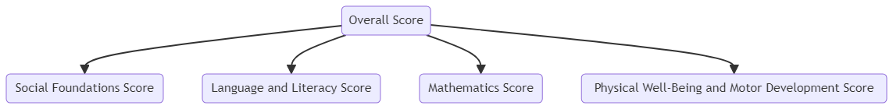

# Assessment Details

## Assessment Identifier(s)
- KRA (the name of the assessment)

## Assessment Family
- None yet

## Assessment Score Method Descriptors
- uri://ed.sc.gov/assessmentReportingMethodDescriptor#ScaleScore
- uri://ed.sc.gov/assessmentReportingMethodDescriptor#PerformanceLevel

# Hierarchy

## StudentAssessmentEducationOrganizationAssociation
-SchoolCode is mapped for this entity. 

## Reasoning
The kindergarten readiness assessment is a composite assessment with objectives such as:
- Social Foundation  mapping to Social Foundations academic subject 
- Language and Literacy  mapping to English/Language Arts academic subject 
- Mathematics mapping to Mathematics academic subject 
- Physical Well-Being and Motor Development  mapping to Physical Well-Being academic subject  
in the North Carolina Academic subject name space .

## Summary of Descriptor Fields and Mappings

### assessmentCategoryDescriptor:
- **assessments.jsont**: `uri://ed-fi.org/assessmentCategoryDescriptor#{{assessmentCategoryDescriptor}}`
- **assessments.csv**: kindergarten Readiness

### academicSubjectDescriptor:
- **assessments.jsont**: `uri://ed.sc.gov/AcademicSubjectDescriptor#{{academicSubjectDescriptor}}`
- **assessments.csv**: Composite 

### assessmentReportingMethodDescriptor:
- **assessments.jsont**: `{{namespace}}/AssessmentReportingMethodDescriptor#ScaleScore`
- **objectiveAssessments.jsont**: `{{namespace}}/AssessmentReportingMethodDescriptor#ScaleScore`
- **studentAssessments.jsont**: `{{namespace}}/AssessmentReportingMethodDescriptor#ScaleScore`
- **studentAssessments.jsont (within studentObjectiveAssessments)**: `{{namespace}}/AssessmentReportingMethodDescriptor#ScaleScore`
- here the namespace is :  `uri://ed.sc.gov/KRA` 
### resultDatatypeTypeDescriptor:
- **assessments.jsont**: `uri://ed-fi.org/ResultDatatypeTypeDescriptor#Integer`
- **objectiveAssessments.jsont**: `uri://ed-fi.org/ResultDatatypeTypeDescriptor#Integer`
- **studentAssessments.jsont**: `uri://ed-fi.org/ResultDatatypeTypeDescriptor#Integer`
- **studentAssessments.jsont (within studentObjectiveAssessments)**: `uri://ed-fi.org/ResultDatatypeTypeDescriptor#Integer`

### performanceLevelDescriptor:
- **studentAssessments.jsont**: `{{namespace}}/PerformanceLevelDescriptor#{{PerformanceLevelDescriptor}}`
- **studentAssessments.jsont (within studentObjectiveAssessments)**: `{{namespace}}/PerformanceLevelDescriptor#{{PerformanceLevel_SFScore}}, {{PerformanceLevel_LLScore}}, {{PerformanceLevel_MAScore}}, {{PerformanceLevel_PDScore}}`
-Here the performance level descriptors match the top level values :Demonstrating Readiness, Emerging Readiness and Approaching Readiness 
### whenAssessedGradeLevelDescriptor:
- **studentAssessments.jsont**: `{{whenAssessedGradeLevelDescriptor}}`
-Here there is an assumption made the exam is taken by prekindergarten/preschool students : uri://ed-fi.org/GradeLevelDescriptor#Prekindergarten/Preschool
### educationOrganizationAssociationTypeDescriptor:
- **educationOrganizationAssociationTypeDescriptor**: `uri://ed-fi.org/EducationOrganizationAssociationTypeDescriptor#Administration`

### Other mapping decisions  
- using **DistrictCode** vs **SchoolCode** for the studentAssessmentEducationOrganizationAssociation entity.

