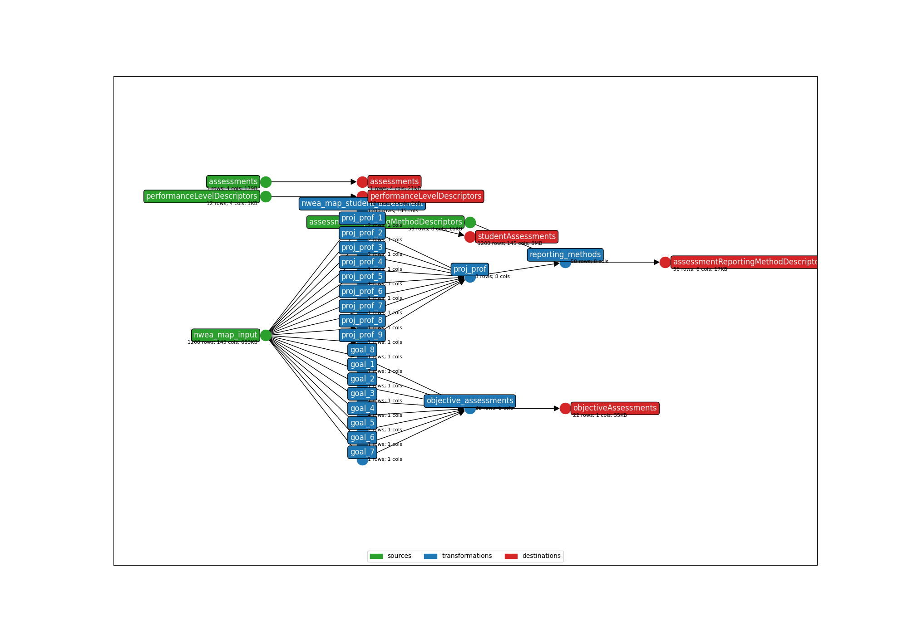

This is an earthmover bundle created from the following Ed-Fi Data Import Tool mapping:
* **Title**: NWEA MAP Growth Assessment Results - API 3.X
* **Description**: This template includes the NWEA MAP Growth Math and Reading Assessments. It covers vendor file exports AssessmentResults and ComboStudentAssessment, and handles format changes that have occurred over the last several years (as of 2023).
* **API version**: 5.2
* **Submitter name**: Erik Joranlien
* **Submitter organization**: Education Analytics

To run this bundle, please add your own source file(s) and column(s):
<details>
<summary><code>data/AssessmentResults.csv</code></summary>
This bundle works with the standard NWEA Map exports AssessmentResults.csv or 
ComboStudentAssessment.csv.

It tries to retain compatibility across various versions of these file specifications
by looking for both the old and new names of changed columns.

</details>

Or use the sample file (`data/sample_anonymized_file.csv`).

## CLI Parameters

### Required
- OUTPUT_DIR: Where output files will be written
- STATE_FILE: Where to store the earthmover runs.csv file
- INPUT_FILE: The assessment file to be mapped
- STUDENT_ID_NAME: Which column to use as the Ed-Fi `studentUniqueId`. Can be one of the native columns in the assessment file (`StudentID` or `Student_StateID`).

### Examples
Using an ID column from the assessment file:
```bash
earthmover run -c earthmover.yaml -p '{
"STATE_FILE": "./runs.csv",
"INPUT_FILE": "data/sample_anonymized_file.csv",
"OUTPUT_DIR": "output/",
"STUDENT_ID_NAME": "Student_StateID"}'
```

Once you have inspected the output JSONL for issues, check the settings in `lightbeam.yaml` and transmit them to your Ed-Fi API with
```bash
lightbeam validate+send -c ./lightbeam.yaml -p '{
"DATA_DIR": "./output/",
"EDFI_API_CLIENT_ID": "yourID",
"EDFI_API_CLIENT_SECRET": "yourSecret" }'
```



(**Above**: a graphical depiction of the dataflow.)


# Maintenance notes
There's an included file called `score_codegen.py` which uses the data in the seed tables to generate the long jinja snippets in the `jsont` files. 

Whenever the Map file changes format, we only need to add rows to `assessmentReportingMethodDescriptors.csv` (and change the `is_deprecated` field for any deprecated columns). 

Then, running `score_codegen.py` will generate a few blocks of code that can be pasted into the appropriate places in the `jsont` files. (This part of the process is manual).