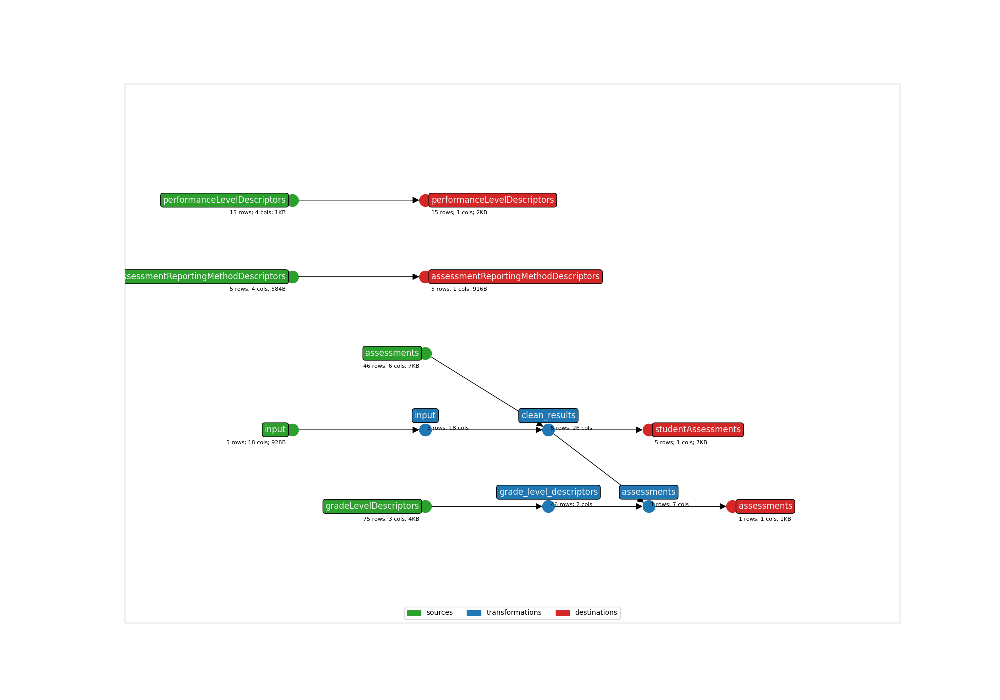

* **Title**: Mastery View Predictive Assessment - API 3.X
* **Description**: This template maps Mastery View Predictive Assessment files. 
* **API version**: 5.2
* **Submitter name**: Ryan Aguilar
* **Submitter organization**: Education Analytics

To run this bundle, please add your own source file(s) and column(s):
<details>
<summary><code>data/Mastery View Predictive Assessment results.csv</code></summary>
This template will only work with the Mastery View Predictive Assessment results at this time.
</details>

Or use the sample file (`data/sample_anonymized_file.csv`).

## CLI Parameters

### Required
- OUTPUT_DIR: Where output files will be written
- STATE_FILE: Where to store the earthmover runs.csv file
- INPUT_FILE: The student assessment file to be mapped
- STUDENT_ID_NAME: Which column to use as the Ed-Fi `studentUniqueId`. Default column is the 'Student Primary ID' from the DIBELS 8th Edition Benchmark file.

### Examples
Using an ID column from the assessment file:
```bash
earthmover run -c ./earthmover.yaml -p '{
"STATE_FILE": "./runs.csv",
"INPUT_FILE": "data/sample_anonymized_file.csv",
"OUTPUT_DIR": "output/",
"STUDENT_ID_NAME": "Student Primary ID"}'
```

Once you have inspected the output JSONL for issues, check the settings in `lightbeam.yaml` and transmit them to your Ed-Fi API with
```bash
lightbeam validate+send -c ./lightbeam.yaml -p '{
"DATA_DIR": "./output/",
"EDFI_API_BASE_URL": "yourURL",
"EDFI_API_CLIENT_ID": "yourID",
"EDFI_API_CLIENT_SECRET": "yourSecret",
"API_YEAR": "yourAPIYear" }'
```



(**Above**: a graphical depiction of the dataflow.)