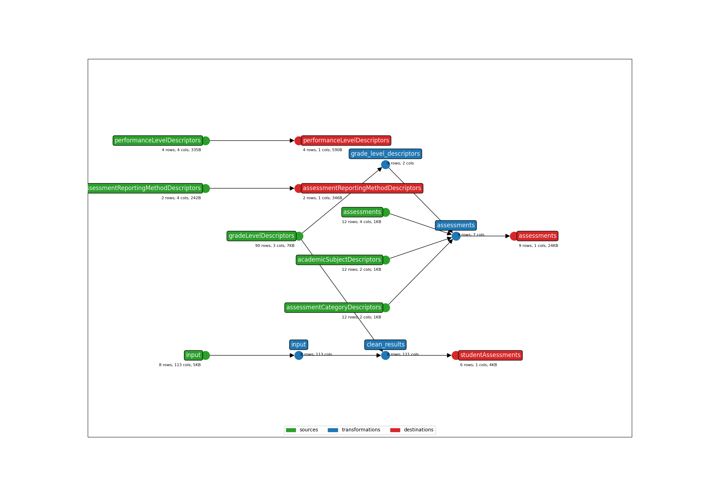

* **Title**: Missouri Assessment Bundle
* **Description**: Bundle for the Missouri Assessment Program (MAP) of the Missouri's Department of Elementary and Secondary Education. Currently supports MAP, MAP-A (Alternative), and EOC (End-of-Course).
* **Submitter name**: Jacob Bortell
* **Submitter organization**: Education Analytics

## Running this bundle without Student ID Xwalking

To run this bundle without implementing the student ID xwalking packages:
```bash
earthmover run -c ./earthmover.yaml -p '{
  "STATE_FILE": "./runs.csv",
  "INPUT_FILE": "data/sample_anonymized_file.csv",
  "OUTPUT_DIR": "output/" ,
  "STUDENT_ID_NAME": "MOSIS_STATE_ID",
}'
```

## CLI Parameters
See the `bundle_metadata.jsonl` file for more information about the CLI parameters in this bundle.

## Lightbeam
There is no ODS to test this particular fake assessment against.

For real assessment data with an ODS to compare/send to, check the settings in `lightbeam.yaml` and transmit them to your Ed-Fi API with the following command:
```bash
lightbeam validate+send -c ./lightbeam.yaml -p '{
"DATA_DIR": "./output/",
"EDFI_API_BASE_URL": "yourURL",
"EDFI_API_CLIENT_ID": "yourID",
"EDFI_API_CLIENT_SECRET": "yourSecret",
"API_YEAR": "yourAPIYear" }'
```

## Additional Resources
To read more in-depth documentation on Ed-Fi Assessment Data Integration, see this [link](https://edanalytics.slite.page/p/CxcM2foMcOuk1m/Ed-Fi-Assessment-Integrations-using-earthmover-and-lightbeam-Documentation).

## DAG Graph


(**Above**: a graphical depiction of the dataflow.)