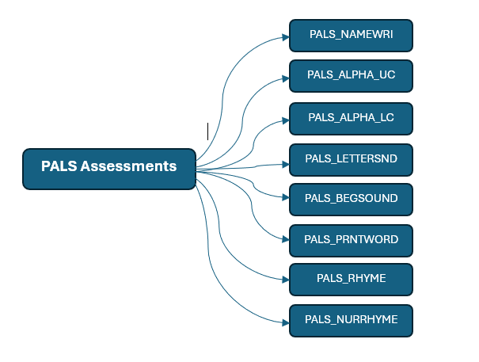

# PALS Assessment Bundle Documentation

# Assessments
## Assessments Identifiers
- Each PALS assessment component is mapped to a unique Assessment file
- Assessment Identifiers:
  - PALS_NAMEWRI: Name Writing Assessment
  - PALS_ALPHA_UC: Uppercase Alphabet Knowledge
  - PALS_ALPHA_LC: Lowercase Alphabet Knowledge
  - PALS_LETTERSND: Letter Sounds
  - PALS_BEGSOUND: Beginning Sounds
  - PALS_PRNTWORD: Print and Word Awareness
  - PALS_RHYME: Rhyme Awareness
  - PALS_NURRHYME: Nursery Rhyme Awareness

## Assessment Family
PALS

## Assessments Score Method Descriptors
For each assessment there will be one score method descriptor:
 - PALS_NAMEWRI_NumScore
 - PALS_ALPHA_UC_NumScore
 - PALS_ALPHA_LC_NumScore
 - PALS_LETTERSND_NumScore
 - PALS_BEGSOUND_NumScore
 - PALS_PRNTWORD_NumScore
 - PALS_RHYME_NumScore
 - PALS_NURRHYME_NumScore
  
  All of them are reported using a number score.
  
# Hierarchy

## Reasoning
This bundle processes PALS (Phonological Awareness Literacy Screening) assessment data, transforming it into Ed-Fi compatible assessment and student assessment records. The bundle handles multiple PALS assessments including name writing, alphabet knowledge (uppercase and lowercase), letter sounds, beginning sounds, print and word awareness, and rhyme and nursery rhyme awareness.

# Data Sources

## Input Requirements
- Primary source file containing student PALS assessment data with the following required columns:
  - STD_STI or ID: possible values of student unique identifier.
  - SCH_NO: School identifier
  - ASSESSDATE: Assessment administration date
  - YEAR: School year. The highest value of the school year (2022-2023 -> 2023)
  - SEMESTER: possible values f, m, s  
  - Assessment scores:
    - NAMEWRI: Name writing score
    - ALPHA_UC: Uppercase alphabet knowledge score
    - ALPHA_LC: Lowercase alphabet knowledge score
    - LETTERSND: Letter sounds score
    - BEGSOUND: Beginning sounds score
    - PRNTWORD: Print and word awareness score
    - RHYME: Rhyme awareness score
    - NURRHYME: Nursery rhyme awareness score

## Bundle Seeds
- assessments.csv: Contains assessment metadata
- assessmentReportingMethodDescriptors.csv: Contains assessment reporting methods
- assessmentCategoryDescriptors.csv: Contains category descriptors
- assessmentPeriodDescriptors.csv: Contains period descriptors
- gradeLevelDescriptors.csv: Contains grade level descriptors
- semester_mapping.csv: Contains a mapping for semester (f: F, m: Mid-Year, and s: S)

# Ed-Fi Mapping
This bundle produces the following Ed-Fi resources:

## StudentAssessments
- studentAssessmentIdentifier: Generated using MD5 hash of assessmentIdentifier, studentUniqueId, and assessment date
- administrationDate: Mapped from ASSESSDATE
- schoolYear: Mapped from YEAR
- studentReference: Mapped from studentUniqueId
- performanceLevels: Not included
- scoreResults:
  - assessmentReportingMethodDescriptor: Mapped from descriptor source
  - resultDatatypeTypeDescriptor: Set to "Integer"
  - result: Mapped from corresponding assessment score column

## Summary of Descriptor Fields and Mappings

### academicSubjectDescriptor:
- **Namespace**: `uri://ed.sc.gov/AcademicSubjectDescriptor#Early Literacy`

### gradeLevelDescriptor:
- **Namespace**: `uri://ed-fi.org/GradeLevelDescriptor#Kindergarten`

### assessmentCategoryDescriptor:
- **Namespace**: `uri://ed-fi.org/AssessmentCategoryDescriptor#Readiness`

### assessmentPeriodDescriptor
- **Namespace**: `uri://ed.sc.gov/AssessmentPeriodDescriptor`
- **assessments.csv**: Mapped from semester_mapping.csv (f = F, m = Mid­-Year, s = S)
  
### assessmentReportingMethodDescriptor:
- **Namespace**: `uri://ed.sc.gov/PALS/AssessmentReportingMethodDescriptor`
- **codeValue**: PALS_NAMEWRI_NumScore, PALS_ALPHA_UC_NumScore, PALS_ALPHA_LC_NumScore, PALS_LETTERSND_NumScore, PALS_BEGSOUND_NumScore, PALS_PRNTWORD_NumScore, PALS_RHYME_NumScore, PALS_NURRHYME_NumScore.

### resultDatatypeTypeDescriptor:
- **Namespace**: `uri://ed-fi.org/ResultDatatypeTypeDescriptor#Integer`

### whenAssessedGradeLevelDescriptor:
- **Namespace**: `uri://ed-fi.org/GradeLevelDescriptor#0`

### educationOrganizationAssociationTypeDescriptor
- **Namespace**: `uri://ed-fi.org/EducationOrganizationAssociationTypeDescriptor#Administration`

# Transformations

## prepare_assessments
Prepares assessment metadata by joining assessment information with grade level and reporting method descriptors.

## Student Assessment Transformations
Eight parallel transformations, one for each PALS assessment component:
- student_assessment_namewri
- student_assessment_alpha_uc
- student_assessment_alpha_lc
- student_assessment_lettersnd
- student_assessment_begsound
- student_assessment_prntword
- student_assessment_rhyme
- student_assessment_nurrhyme

Each transformation:
1. Adds specific assessmentIdentifier
2. Maps student and school identifiers
3. Adds assessment administration metadata
4. Generates unique studentAssessmentIdentifier
5. Joins with reporting method descriptors
6. Creates score JSON structure

All of them combined in one output file.

# Output Files

- assessmentReportingMethodDescriptors.jsonl
- assessmentPeriodMethodDescriptors.jsonl
- assessmentCategoryMethodDescriptors.jsonl
- assessments.jsonl
- studentAssessmentEducationOrganizationAssociations.jsonl
- student_assessments.jsonl

# Configuration Parameters
- STUDENT_ID_NAME: Column name for student identifier
- INPUT_FILE: Path to input data file
- OUTPUT_DIR: Directory for output files
- BUNDLE_DIR: Directory containing seed files

# Dependencies
- Requires Earthmover version 0.3.8 or higher
- Requires template files:
  - ./templates/assessments.jsont
  - ./templates/assessmentReportingMethodDescriptors.jsont
  - ./templates/assessmentCategoryDescriptors.jsont
  - ./templates/descriptors.jsont
  - ./templates/studentAssessments.jsont
  - ./templates/studentAssessmentEducationOrganizationAssociations.jsont

