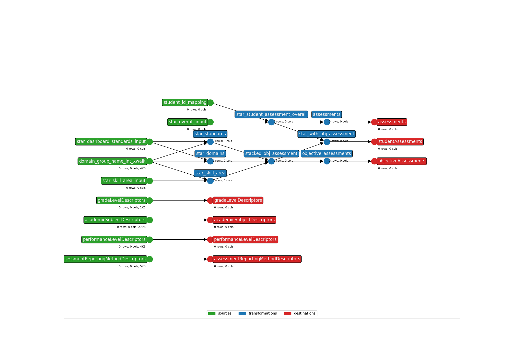

* **Title**: Renaissance Star - API 3.X
* **Description**: This template includes the Renaissance Star overall, dashboard standard, and skill area files for reading, math, and early literacy. It covers vendor file exports {subject}_v2, {subject}_Dashboard_Standards_v2, and {subject}_SkillArea_v1 (Where subjects include "SEL", "SR", "SM").
* **API version**: 5.2
* **Submitter name**: Julianna Alvord
* **Submitter organization**: Education Analytics

To run this bundle, please add your own source file(s) and column(s):
<details>
<summary><code>data/{subject}_v2.csv</code></summary>
Where subjects include "SEL", "SR", "SM". This is the overall student assessment results.
</details>

<details>
<summary><code>data/{subject}_Dashboard_Standards_v2.csv</code></summary>
Where subjects include "SEL", "SR", "SM". This file contains scores/PLs at the Domain Group + Domain Name level, as well as scores/PLs at the Standard Name level.
</details>

<details>
<summary><code>data/{subject}_SkillArea_v2.csv</code></summary>
Where subjects include "SEL", "SR", "SM". This file contains Skill Area Mastery Scores.
</details>

<details>
<summary><code>seeds/student_ids.csv</code></summary>

This is a [crosswalk file](https://en.wikipedia.org/wiki/Schema_crosswalk) for translating the student IDs in the assessment CSVs to student IDs in Ed-Fi (one may be a state ID and the other a district ID, for example). 

This file is **optional**. If one of the existing student IDs within the assessment
file maps to Ed-Fi's `studentUniqueId`, you can omit the crosswalk file and specify 
which column to use.

If neither of these match Ed-Fi's `studentUniqueId`, see the CLI parameters section below.

Required columns:
   - `from`
   - `to`
</details>


## CLI Parameters

### Required
- OUTPUT_DIR: Where output files will be written
- BUNDLE_DIR: Parent folder of the bundle, where `earthmover.yaml` lives
- INPUT_FILE_OVERALL: The overall student assessment file to be mapped
- API_YEAR: The API year that the output of this template will send to
- STUDENT_ID_NAME: Which column to use as the Ed-Fi `studentUniqueId`. Can be one of the native columns in the assessment file, or a value mapped from a crosswalk (must be supplied)

### Optional
- INPUT_FILE_DS: The Dashboard Standard file to be mapped
- INPUT_FILE_SA: The Skill Area file to be mapped
If student IDs must be mapped, provide the following additional parameters:
- STUDENT_ID_XWALK: Path to a two-column CSV mapping `from` and ID included in the assessment file and `to` the `studentUniqueId` value in Ed-Fi
- STUDENT_ID_JOIN_COLUMN: Declare which column in the assessment file should be used for the crosswalk join

When using an ID xwalk, set `STUDENT_ID_NAME` as `to`.

### Examples
Using an ID column from the assessment file:
```bash
earthmover run -c ./earthmover.yaml -p '{
"BUNDLE_DIR": ".",
"INPUT_FILE_OVERALL": "path/to/SEL_v2.csv",
"INPUT_FILE_DS": "path/to/SEL_Dashboard_Standards_v2.csv",
"INPUT_FILE_SA": "path/to/SEL_SkillArea_v1.csv",
"OUTPUT_DIR": "./output",
"STUDENT_ID_NAME": "StudentStateID"}'
```

Using a student ID crosswalk
```bash
earthmover run -c ./earthmover.yaml -p '{
"BUNDLE_DIR": ".",
"INPUT_FILE_OVERALL": "path/to/SEL_v2.csv",
"INPUT_FILE_DS": "path/to/SEL_Dashboard_Standards_v2.csv",
"INPUT_FILE_SA": "path/to/SEL_SkillArea_v1.csv",
"OUTPUT_DIR": "./output",
"STUDENT_ID_XWALK": "path/to/student_id_xwalk.csv",
"STUDENT_ID_JOIN_COLUMN": "StudentStateID",
"STUDENT_ID_NAME": "to"}'
```

Once you have inspected the output JSONL for issues, check the settings in `lightbeam.yaml` and transmit them to your Ed-Fi API with
```bash
lightbeam validate+send -c ./lightbeam.yaml -p '{
"DATA_DIR": "./output/",
"EDFI_API_CLIENT_ID": "yourID",
"EDFI_API_CLIENT_SECRET": "yourSecret",
"EDFI_API_YEAR": yourAPIYear }'
```



(**Above**: a graphical depiction of the dataflow.)