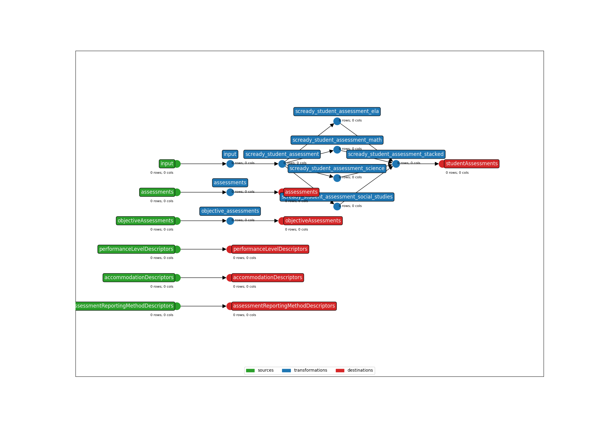

* **Title:** DRC SC READY Assessment Results - API 3.X
* **Description:** Data Recognition Corporation South Carolina College-and Career-Ready Assessment
* **API version:** 5.3
* **Submitter name:** Jay Kaiser
* **Submitter organization:** Education Analytics

To run this bundle, please add your own source file(s) and column(s):
<details>
<summary><code>data/SCREADY.csv</code></summary>
This template will only work with SC READY files (state format) at this time.
</details>

Or use the sample file (`data/sample_anonymized_file.csv`).

## CLI Parameters

### Required
- OUTPUT_DIR: Where output files will be written
- STATE_FILE: Where to store the earthmover runs.csv file
- INPUT_FILE: The student assessment file to be mapped
- STUDENT_ID_NAME: Which column to use as the Ed-Fi `studentUniqueId`. Default column is the 'StateID' from the SC READY file.
- API_YEAR: The year of the assessment file (structure of '2023' or '2024', etc).

### Examples
Using an ID column from the assessment file:
```bash
earthmover run -c ./earthmover.yaml -p '{
"INPUT_FILE": "data/sample_anonymized_file.csv",
"STATE_FILE": "./runs.csv",
"OUTPUT_DIR": "output/",
"STUDENT_ID_NAME": "StateID",
"API_YEAR": "2024"}'
```

Once you have inspected the output JSONL for issues, check the settings in `lightbeam.yaml` and transmit them to your Ed-Fi API with
```bash
lightbeam validate+send -c ./lightbeam.yaml -p '{
"DATA_DIR": "./output/",
"EDFI_API_BASE_URL": "yourURL",
"EDFI_API_CLIENT_ID": "yourID",
"EDFI_API_CLIENT_SECRET": "yourSecret",
"API_YEAR": "yourAPIYear" }'
```



(**Above**: a graphical depiction of the dataflow.)