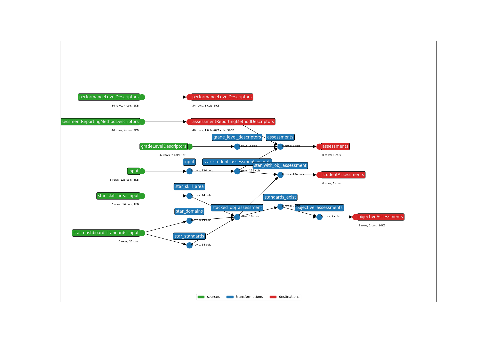

* **Title**: Renaissance Star - API 3.X
* **Description**: This template includes the Renaissance Star overall, dashboard standard, and skill area files for reading, math, and early literacy. It covers vendor file exports {subject}_v2, {subject}_Dashboard_Standards_v2, and {subject}_SkillArea_v1, as well as the same files but without the versioned suffix (Where subjects include "SEL", "SR", "SM").
* **API version**: 5.2
* **Submitter name**: Julianna Alvord
* **Submitter organization**: Education Analytics

To run this bundle, please add your own source file(s) and column(s):
<details>
<summary><code>data/{subject}_v2.csv</code></summary>
Where subjects include "SEL", "SR", "SM". This is the overall student assessment results.
</details>

<details>
<summary><code>data/{subject}_Dashboard_Standards_v2.csv</code></summary>
Where subjects include "SEL", "SR", "SM". This file contains scores/PLs at the Domain Group + Domain Name level, as well as scores/PLs at the Standard Name level.
</details>

<details>
<summary><code>data/{subject}_SkillArea_v2.csv</code></summary>
Where subjects include "SEL", "SR", "SM". This file contains Skill Area Mastery Scores.
</details>

Or use our sample files (`data/*`).

## CLI Parameters

### Required
- OUTPUT_DIR: Where output files will be written
- STATE_FILE: Where to store the earthmover runs.csv file
- INPUT_FILE_OVERALL: The overall student assessment file to be mapped
- API_YEAR: The API year that the output of this template will send to
- STUDENT_ID_NAME: Which column to use as the Ed-Fi `studentUniqueId`. Can be one of the native columns in the assessment file, or a value mapped from a crosswalk (must be supplied)
  
### Examples
Using an ID column from the assessment file:
```bash
earthmover run -c ./earthmover.yaml -p '{
"STATE_FILE": "./runs.csv",
"INPUT_FILE_OVERALL": "./data/SR_sample_anonymized_file.csv",
"INPUT_FILE_DS": "./data/SR_Dashboard_Standards_v2_sample_anonymized_file.csv",
"INPUT_FILE_SA": "./data/SR_SkillArea_v1_sample_anonymized_file.csv",
"API_YEAR": "2024",
"OUTPUT_DIR": "./output",
"STUDENT_ID_NAME": "StudentStateID"}'
```

Once you have inspected the output JSONL for issues, check the settings in `lightbeam.yaml` and transmit them to your Ed-Fi API with
```bash
lightbeam validate+send -c ./lightbeam.yaml -p '{
"DATA_DIR": "./output/",
"EDFI_API_CLIENT_ID": "yourID",
"EDFI_API_CLIENT_SECRET": "yourSecret",
"EDFI_API_YEAR": yourAPIYear }'
```



(**Above**: a graphical depiction of the dataflow.)
