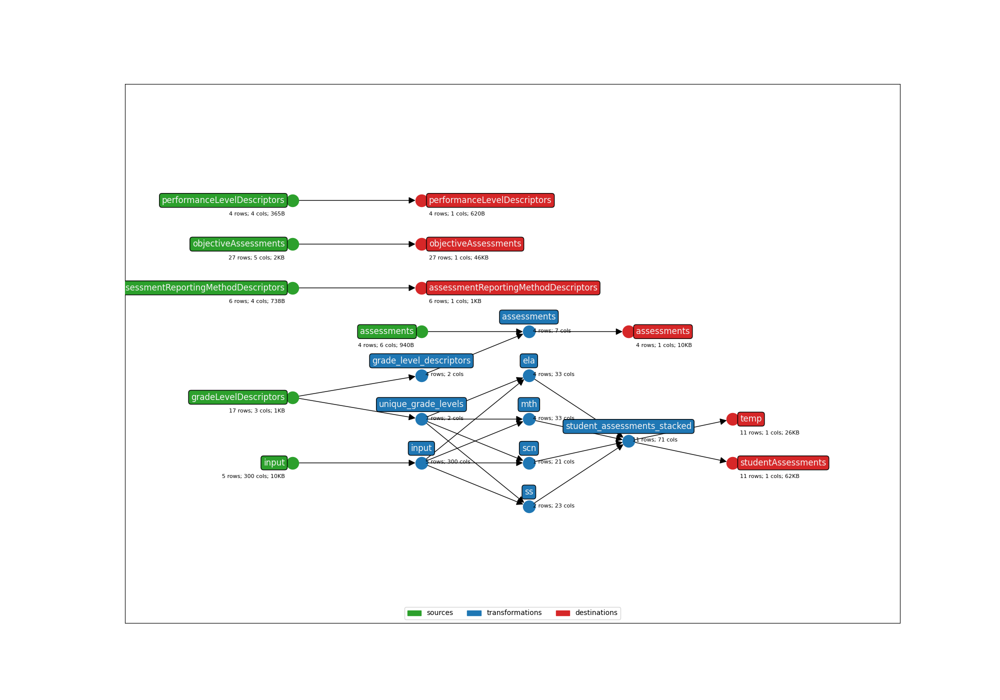

* **Title**: Wisconsin Forward Exam
* **Description**: This maps the state assessment for Wisconsin, the Forward Exam, administered in ELA, mathematics, science, and social studies.
* **Submitter name**: Alex Chen
* **Submitter organization**: Education Analytics

## Model

Data model is based on information in the [User's Guide to Interpreting Reports 2024-25](https://dpi.wi.gov/sites/default/files/imce/assessment/pdf/Forward_Exam_Users_Guide_to_Interpreting_Reports_2024-25.pdf) as well as the [Wisconsin Forward Exam Spring 2024 Technical Report](https://dpi.wi.gov/sites/default/files/imce/assessment/pdf/Final_Forward_Technical_Report_2024.pdf) for 2023-2025. For historical data, information was sourced from:
- For 2022-23, the [2023 Technical Report](https://dpi.wi.gov/sites/default/files/imce/assessment/pdf/EWI270_WIFW_SPRG_23_TECH.pdf) covers the content standards and different scores, especially for major column name and score differences prior to changes in 2024.
- For 2021-22, the [Spring 2022 Technical Report](https://dpi.wi.gov/sites/default/files/imce/assessment/pdf/2022_Technical_Report_Final.pdf) includes past reporting categories and the old Listening domain for ELA, as well as mappings of letter codes to reporting categories to interpret column names.
- For 2020-21, the [2021 Technical Report](https://www.wistatedocuments.org/digital/collection/p267601coll4/id/34743/) covers past column names, especially for SS prior to renaming that occurred in 2021-22.
- For 2017-18, the [2018 Technical Report](https://dpi.state.wi.us/sites/default/files/imce/assessment/pdf/Forward_Exam_Tech_Report_2018.pdf) covers historical content standards and scores, especially for 
storical SCN objective assessments and scores prior to the 2019 update.  

Namespace is `uri://datarecognitioncorp.com` due to the underlying vendor.

## Assessments
Split into four by academic subject; TBD on whether official integration will split by grade as well:
- WIForward_ELA: English Language Arts 
- WIForward_MTH: Mathematics
- WIForward_SCN: Science
- WIForward_SS: Social Studies

For each of the subjects, the following scores/PLs are available:
- Scale score (can be "compared for individual students and groups in a given grade and content area" and "over time for all.. content areas for which the assessment scores are reported on the same year-to-year scale")
	- ELA, math retooled in 2024;
        - "Scale scores for ELA and mathematics for 2023-24 cannot be directly compared to prior years" according to a DPI [press release](https://dpi.wi.gov/news/releases/2024/student-assessment-results-forward). 
	- Science scale same since 2019, social studies scale same since 2022

- Scale score standard error
- Performance level, 1-4/Developing-Advanced, based on scale score (different cuts by grade and by subject)
    - This is called 'Proficiency' in 2022-23 and prior but is also a four-category performance level. The categories then are called 'Below Basic', 'Basic', 'Proficient', and 'Advanced'
- WI percentile
- [WI Normal Curve Equivalent (NCE)](https://dpi.wi.gov/sites/default/files/imce/assessment/pdf/Percentile_Rank_Vs_Normal_Curve_Equivalent.pdf), prior to 2024

## Objective assessments

### Domains
ELA is the only assessment split into domains, 1) Reading and 2) Writing/Language. Each of these has, like the top-level assessments, starting in 2024:
- Scale score
- Scale score standard error 
- Performance level, 1-4
- WI percentile

Prior to revisions in 2023-24, there was an additional Listening domain and scores/performance levels were as follows:
- Standard performance index (SPI) score
- SPI performance levels based on SPI scores


### Reporting categories / content standards
Separate from domains, Forward also provides raw points, scale scores, and performance levels for each of the following reporting categories. Each category is targeted at specific knowledge areas, skills, or concepts. These differ by subject and can differ by grade for certain subjects. From 2023-24 onwards, scale scores are called 'Progress Scores' and the derived performance levels 'Progress Levels'. Prior, these were 'SPI (Standard Performance Index) Scores' and 'SPI Levels'; SPIs were also provided with upper and lower bounds.

ELA:
- Reading
	- Key Ideas and Details
	- Craft and Structure/Integration of Knowledge
	- Vocabulary Use
- Written/Language
	- Text Types and Purposes
	- Inquiry to Build and Present Knowledge (starting in 2023-24)
	- Language Conventions
    - Research (prior to 2023-24)

Math:
- Operations and Algebraic Thinking (grades 3-5)
- Number and Operations in Base Ten (grades 3-5)
- Number and Operations - Fractions (grades 3-5)
- Measurement and Data (grades 3-5)
- Geometry (grades 3-8)
- Ratios and Proportional Relationships (grades 6-7)
- The Number System (grades 6-8)
- Expressions and Equations (grades 6-8)
- Statistics and Probability (grades 6-8)
- Functions (grades 8)

Social Studies: (same for all grades)
- Behavioral Sciences
- Economics
- Geography
- History
- Political Science and Citizenship

Science (same for all grades, prefixed by 'Practices and Crosscutting Concepts in' from 2024 onwards):
- Life Science
- Physical Science
- Earth and Space Science
- Engineering (starting in 2019)
- Science Connections and Nature of Science (prior to 2019)
- Science Inquiry (prior to 2019)
- Science Applications and Personal Social Perspectives (prior to 2019)


## Accommodations and supports
Accommodations and supports are included, with mappings documented in `seeds/columns_to_accommodations.csv`. These are currently intended to best match the 2024-25 version of the assessment, with historical accommodations aligned where possible. There are some subject-specific accommodations, such as Read Aloud Passages or Listening Scripts for ELA or Multiplication Table for MTH.

## General Bundle Best-Practices
This bundle follows our current best-practices, which include:
- Implementing our Student ID Xwalking logic. To learn more about our student ID xwalk feature, see this [README](https://github.com/edanalytics/earthmover_edfi_bundles/tree/student_id_alignment/packages/student_ids). The student ID xwalking section below includes more information about imeplementing this feature in production. 
- Containing all default Ed-Fi descriptors (except for dataTypeDescriptors) in seed files, and never hard-coding those values in the templates. This allows an implementation to override those using [project composition](https://github.com/edanalytics/earthmover?tab=readme-ov-file#project-composition) in cases where the destination uses custom descriptors. This is typically true for gradeLevelDescriptors and academicSubjectDescriptors. 
- Including an **ANONYMIZED** sample file in the `data` folder. **DO NOT push real student data (PII) to GitHub**.
- Mapping the assessment following [Ed-Fi Assessment Data Governance best practices](https://edanalytics.slite.page/p/FwwhB84DoYVjY1/NEW-Assessment-Data-Governance-in-Ed-Fi).
- Adding a `bundle_metadata.json` file with information about Ed-Fi data model version & assessment file years compatability, required and optional fields, and bundle parameters.
  - Note: the structure of this file will likely change.
- Including a single `earthmover.yaml` file. If multiple are created to simplify code, one `earthmover.yaml` file should unify them, parameterized as necessary.
- Writing an in-depth README.
- Following minor consistency rules:
    + Not including the vendor of the assessment into the assessment identifier.
    + Not including the vendor of the assessment in the folder name of this bundle.
    + Ending the earthmover and lightbeam config files with `.yaml` instead of `.yml`.
    + Using relative paths.
- In the `studentAssessments.jsont` file, listing out all score results/performance levels in one object and iterating in a for-loop:
```Jinja
"scoreResults": [
    

    
    
      
        
      
    

    
      {
        "assessmentReportingMethodDescriptor": "{{namespace}}/AssessmentReportingMethodDescriptor#{{score[1]}}",
        "resultDatatypeTypeDescriptor": "uri://ed-fi.org/ResultDatatypeTypeDescriptor#{{score[2]}}",
        "result": "{{score[0]}}"
      } ,
    
  ]
```

## Using this bundle as a template
Some of the logic/code in this bundle can/should stay exactly as written here. This is _especially_ true of the student ID xwalking logic:
- All default params (though some of the _values_ may need to change assessment by assessment)
- The initial 'input' transformation with an empty list of operations
- Lines 48-51, which creates a standard `studentUniqueId` column. 

Other aspects of this bundle offer examples of helpful code logic & best-practices, but will need to be entirely customized for each new assessment.

## Running this bundle without Student ID Xwalking
To run this bundle without implementing the student ID xwalking packages:
```bash
earthmover run -c ./earthmover.yaml -p '{
"STATE_FILE": "./runs.csv",
"INPUT_FILE": "data/sample_anonymized_file.csv",
"OUTPUT_DIR": "output/" ,
"STUDENT_ID_NAME": "studentId",
"EDFI_DS_VERSION": "4"
}'
```

## Implementing the Student ID XWalking Packages
The goal for writing these packages was to dynamically determine the 'types' of student ID from the assessment file using Ed-Fi studentEducationOrganizationAssociation data as a source of truth for rostering information. This will allow us to map as many student assessment records to a studentUniqueId value as possible without requiring a user to:
- Know ahead of time which ID column from the assessment file to set as the studentUniqueId or
- Know ahead of time which ID column from the assessment file to map to the studentUniqueId _and_ provide a crosswalk

This bundle is set up to _not_ use this feature as-is, so the bundle will set the studentId column in the fake sample assessment file as the student unique ID because that is the default value for the `STUDENT_ID_NAME` parameter. This should be the behavior of all assessment bundles.

However, we also included a sample studentEducationOrganizationAssociation file (would be equivalent structurally to output of `lightbeam fetch -s studentEducationOrganizationAssociations -k studentIdentificationCodes,educationOrganizationReference,studentReference`) in order to test the student ID Xwalking feature. To do so, please see the [student_id_wrapper]() for detailed instructions.

The student ID xwalking feature will ensure that every student _will_ match a student in Ed-Fi and you will not hit unintended 'missing student' errors at the `lightbeam send` stage. Any student record from the original source file that cannot be matched to the Ed-Fi roster source will be dropped and written to a separate file: `output/input_no_student_id_match.csv`.

## CLI Parameters
See the `bundle_metadata.jsonl` file for more information about the CLI parameters in this bundle.

## Lightbeam
There is no ODS to test this particular fake assessment against.

For real assessment data with an ODS to compare/send to, check the settings in `lightbeam.yaml` and transmit them to your Ed-Fi API with the following command:
```bash
lightbeam validate+send -c ./lightbeam.yaml -p '{
"DATA_DIR": "./output/",
"EDFI_API_BASE_URL": "yourURL",
"EDFI_API_CLIENT_ID": "yourID",
"EDFI_API_CLIENT_SECRET": "yourSecret",
"API_YEAR": "yourAPIYear" }'
```

## Additional Resources
To read more in-depth documentation on Ed-Fi Assessment Data Integration, see this [link](https://edanalytics.slite.page/p/CxcM2foMcOuk1m/Ed-Fi-Assessment-Integrations-using-earthmover-and-lightbeam-Documentation).

## DAG Graph


(**Above**: a graphical depiction of the dataflow.)
