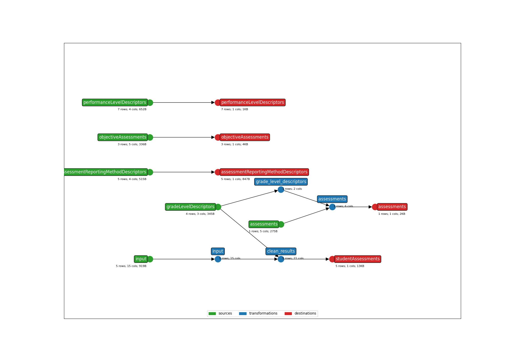

* **Title**: Template Bundle
* **Description**: This is a template bundle that will map a fake assessment. 
* **Submitter name**: Julianna Alvord
* **Submitter organization**: Education Analytics

This bundle has _two_ use-cases:
1. As a template/starting point for writing a new bundle. This bundle includes logic that should be included in every other assessment bundle.
2. As a sample project to learn the components of an assessment bundle.

## Important Note
<mark style="background-color: #FDFD96">Some aspects of this bundle are still under discussion - anything here is subject to change, but not significantly.</mark>

## General Bundle Best-Practices
This bundle follows our current best-practices, which include:
- Implementing our Student ID Xwalking logic. To learn more about our student ID xwalk feature, see this [README](https://github.com/edanalytics/earthmover_edfi_bundles/tree/student_id_alignment/packages/student_ids). The student ID xwalking section below includes more information about imeplementing this feature in production. 
- Containing all default Ed-Fi descriptors (except for dataTypeDescriptors) in seed files, and never hard-coding those values in the templates. This allows an implementation to override those using [project composition](https://github.com/edanalytics/earthmover?tab=readme-ov-file#project-composition) in cases where the destination uses custom descriptors. This is typically true for gradeLevelDescriptors and academicSubjectDescriptors. 
- Including an **ANONYMIZED** sample file in the `data` folder. **DO NOT push real student data (PII) to GitHub**.
- Mapping the assessment following [Ed-Fi Assessment Data Governance best practices](https://edanalytics.slite.page/p/FwwhB84DoYVjY1/NEW-Assessment-Data-Governance-in-Ed-Fi).
- Adding a `bundle_metadata.json` file with information about Ed-Fi data model version & assessment file years compatability, required and optional fields, and bundle parameters.
  - Note: the structure of this file will likely change.
- Including a single `earthmover.yaml` file. If multiple are created to simplify code, one `earthmover.yaml` file should unify them, parameterized as necessary.
- Writing an in-depth README.
- Following minor consistency rules:
    + Not including the vendor of the assessment into the assessment identifier.
    + Not including the vendor of the assessment in the folder name of this bundle.
    + Ending the earthmover and lightbeam config files with `.yaml` instead of `.yml`.
    + Using relative paths.
- In the `studentAssessments.jsont` file, listing out all score results/performance levels in one object and iterating in a for-loop:
```Jinja
"scoreResults": [
    

    
    
      
        
      
    

    
      {
        "assessmentReportingMethodDescriptor": "{{namespace}}/AssessmentReportingMethodDescriptor#{{score[1]}}",
        "resultDatatypeTypeDescriptor": "uri://ed-fi.org/ResultDatatypeTypeDescriptor#{{score[2]}}",
        "result": "{{score[0]}}"
      } ,
    
  ]
```

## Using this bundle as a template
Some of the logic/code in this bundle can/should stay exactly as written here. This is _especially_ true of the student ID xwalking logic:
- All default params (though some of the _values_ may need to change assessment by assessment)
- The initial 'input' transformation with an empty list of operations
- Lines 48-51, which creates a standard `studentUniqueId` column. 

Other aspects of this bundle offer examples of helpful code logic & best-practices, but will need to be entirely customized for each new assessment.

## Running this bundle without Student ID Xwalking
To run this bundle without implementing the student ID xwalking packages:
```bash
earthmover run -c ./earthmover.yaml -p '{
"STATE_FILE": "./runs.csv",
"INPUT_FILE": "data/sample_anonymized_file.csv",
"OUTPUT_DIR": "output/" 
}'
```

## Implementing the Student ID XWalking Packages
The goal for writing these packages was to dynamically determine the 'types' of student ID from the assessment file using Ed-Fi studentEducationOrganizationAssociation data as a source of truth for rostering information. This will allow us to map as many student assessment records to a studentUniqueId value as possible without requiring a user to:
- Know ahead of time which ID column from the assessment file to set as the studentUniqueId or
- Know ahead of time which ID column from the assessment file to map to the studentUniqueId _and_ provide a crosswalk

This bundle is set up to _not_ use this feature as-is, so the bundle will set the studentId column in the fake sample assessment file as the student unique ID because that is the default value for the `STUDENT_ID_NAME` parameter. This should be the behavior of all assessment bundles.

However, we also included a sample studentEducationOrganizationAssociation file (would be equivalent structurally to output of `lightbeam fetch -s studentEducationOrganizationAssociations -k studentIdentificationCodes,educationOrganizationReference,studentReference`) in order to test the student ID Xwalking feature. To do so, please see the [student_id_wrapper]() for detailed instructions.

The student ID xwalking feature will ensure that every student _will_ match a student in Ed-Fi and you will not hit unintended 'missing student' errors at the `lightbeam send` stage. Any student record from the original source file that cannot be matched to the Ed-Fi roster source will be dropped and written to a separate file: `output/input_no_student_id_match.csv`.

## CLI Parameters
See the `bundle_metadata.jsonl` file for more information about the CLI parameters in this bundle.

## Lightbeam
There is no ODS to test this particular fake assessment against.

For real assessment data with an ODS to compare/send to, check the settings in `lightbeam.yaml` and transmit them to your Ed-Fi API with the following command:
```bash
lightbeam validate+send -c ./lightbeam.yaml -p '{
"DATA_DIR": "./output/",
"EDFI_API_BASE_URL": "yourURL",
"EDFI_API_CLIENT_ID": "yourID",
"EDFI_API_CLIENT_SECRET": "yourSecret",
"API_YEAR": "yourAPIYear" }'
```

## Additional Resources
To read more in-depth documentation on Ed-Fi Assessment Data Integration, see this [link](https://edanalytics.slite.page/p/CxcM2foMcOuk1m/Ed-Fi-Assessment-Integrations-using-earthmover-and-lightbeam-Documentation).

## DAG Graph


(**Above**: a graphical depiction of the dataflow.)