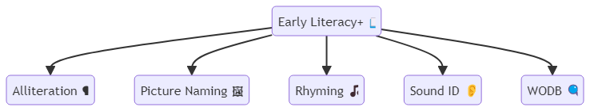
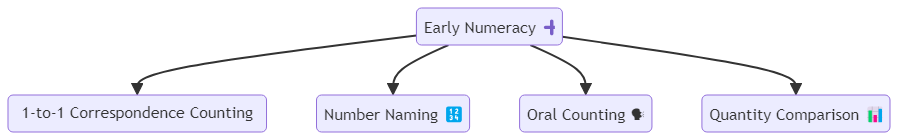
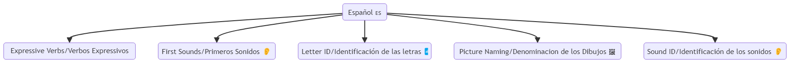
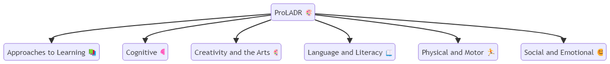

# Assessment Details

## Assessment Identifier(s)
The assessment identifiers are formed using the following pattern:
- `assessmentIdentifier: {{ assessment_name.replace(' ', '') }}_{{ objective.replace(' ', '') }}`

### Example
For the assessment name "Early Literacy+" and the objective "Alliteration", the assessment identifier would be:
- `EarlyLiteracy+_Alliteration`

### Assessment Names and Objectives
#### Assessment Names:
- Early Literacy+
- Early Numeracy
- Español
- ProLADR

#### Objectives:
- **Early Literacy+:**
  - Alliteration
  - Picture Naming
  - Rhyming
  - Sound ID
  - WODB
- **Early Numeracy:**
  - 1-to-1 Correspondence Counting
  - Number Naming
  - Oral Counting
  - Quantity Comparison
- **Español:**
  - Expressive Verbs/Verbos Expressivos
  - First Sounds/Primeros Sonidos
  - Letter ID/Identificación de las letras
  - Picture Naming/Denominacion de los Dibujos
  - Sound ID/Identificación de los sonidos
- **ProLADR:**
  - Approaches to Learning
  - Cognitive
  - Creativity and the Arts
  - Language and Literacy
  - Physical and Motor
  - Social and Emotional

## Assessment Family
The assessment family is set as the `assessment_name`:
- Early Literacy+
- Early Numeracy
- Español
- ProLADR

## Assessment Score Method Descriptors
- uri://ed.sc.gov/assessmentReportingMethodDescriptor#ScaleScore
- uri://ed.sc.gov/assessmentReportingMethodDescriptor#PerformanceLevel

# Hierarchy

- Early Literacy+

- Early Numeracy

- Espanol

- ProLADR

## StudentAssessmentEducationOrganizationAssociation
- The EducationOrganizationId that is used is : Init District Id
## Reasoning
The myIGDIs assessment is designed to measure individual growth and development indicators across various domains. The objectives include:
- Early Literacy+ mapping to English/Language Arts academic subject
- Early Numeracy mapping to Mathematics academic subject
- Español mapping to Spanish academic subject
- ProLADR mapping to multiple developmental domains

## Summary of Descriptor Fields and Mappings

### assessmentCategoryDescriptor:
- **assessments.jsont**: `uri://ed-fi.org/assessmentCategoryDescriptor#{{assessmentCategoryDescriptor}}`
- **assessments.csv**: Kindergarten Readiness

### academicSubjectDescriptor:
- **assessments.jsont**: `uri://ed.sc.gov/AcademicSubjectDescriptor#{{academicSubjectDescriptor}}`
- **assessments.csv**: 
  - Early Literacy+:
    - Early Literacy
  - Early Numeracy:
    - Mathematics
  - Español:
    - Early Literacy
  - ProLADR:
    - Approaches to Learning: Non-instructional OR Executive Functioning
    - Cognitive: Non-instructional OR Executive Functioning
    - Creativity and the Arts: Non-instructional OR Executive Functioning
    - Language and Literacy: Early Literacy
    - Physical and Motor: Physical Well-Being
    - Social and Emotional: Social Foundations

### assessmentReportingMethodDescriptor:
- **assessments.jsont**: `{{namespace}}/AssessmentReportingMethodDescriptor#ScaleScore`

- **studentAssessments.jsont**: `{{namespace}}/AssessmentReportingMethodDescriptor#ScaleScore`
- Here the namespace is: `uri://ed.sc.gov/myIGDIs`

### resultDatatypeTypeDescriptor:
- **assessments.jsont**: `uri://ed-fi.org/ResultDatatypeTypeDescriptor#Integer`
- **studentAssessments.jsont**: `uri://ed-fi.org/ResultDatatypeTypeDescriptor#Integer`

### performanceLevelDescriptor:
- **studentAssessments.jsont**: `{{namespace}}/PerformanceLevelDescriptor#{{PerformanceLevelDescriptor}}`
- Here the performance level descriptors match the **Tier** from the file. The performance level descriptors include:
  - Tier II/III: Performance level indicating Tier II or III
  - Cut Range: Performance level indicating Cut Range
  - Tier I: Performance level indicating Tier I
### whenAssessedGradeLevelDescriptor:
- **studentAssessments.jsont**: `{{whenAssessedGradeLevelDescriptor}}`
- Here there is an assumption made that the exam is taken by kindergarten students: uri://ed-fi.org/GradeLevelDescriptor#Kindergarten

### educationOrganizationAssociationTypeDescriptor:
- **educationOrganizationAssociationTypeDescriptor**: `uri://ed-fi.org/EducationOrganizationAssociationTypeDescriptor#Administration`

### assessmentPeriodDescriptor:
- **studentAssessments.jsont**: `{{namespace}}/AssessmentPeriodDescriptor#{{assessmentPeriodDescriptor}}`
- Here the namespace is: `uri://ed.sc.gov/myIGDIs`
- The assessment period descriptors to be added include:
  - Fall 1
  - Fall 2
  - Fall 3
  - Fall 4
  - Fall Screening
  - Winter 1
  - Winter 2
  - Winter 3
  - Winter 4
  - Winter Screening
  - Spring 1
  - Spring 2
  - Spring 3
  - Spring 4
  - Spring Screening
  - Summer 1
  - Summer 2
  - Summer 3
  - Summer 4
  - Summer Screening