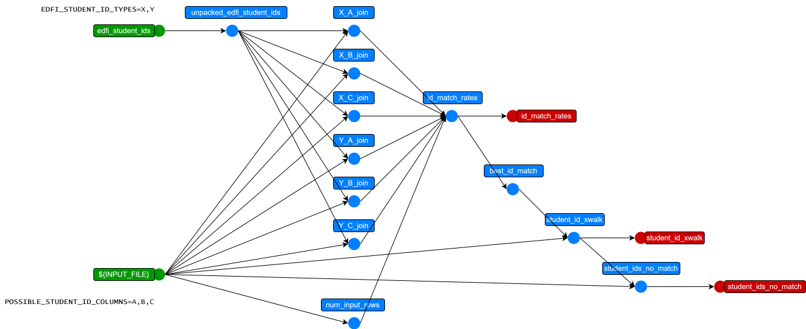

This bundle is meant to be used as a package with other bundles for the purpose of aligning student IDs from source data with known IDs from EdFi.

## Usage

To use this package:
1. include this package in your earthmover project by adding:
    ```yaml
    packages:
      student_id_alignment:
        git: "https://github.com/edanalytics/earthmover_edfi_bundles.git"
        branch: student_id_align
        subdirectory: "packages/student_id_alignment"
    ```
1. provide a source of student IDs known to EdFi as either a query against an [Enable Data Union (EDU)](https://enabledataunion.org/) Ed-Fi data warehouse:
    ```yaml
    sources:
      edfi_student_ids:
        connection: "snowflake://$SNOWFLAKE_USER:$SNOWFLAKE_PASS@$SNOWFLAKE_ACCOUNT?warehouse=$SNOWFLAKE_WAREHOUSE"
        # This is a Snowflake SQL query which constructs a structure like the student ID portion of
        # Ed-Fi studentEducationOrganizationAssociations from EDU warehouse data:
        query: >
          with ids as (
              select
                  tenant_code, api_year, k_student, ed_org_id,
                  object_construct_keep_null('assigningOrganizationIdentificationCode', id_system,
                      'identificationCode', id_code) as stu_id_code,
              from analytics.prod_stage.stg_ef3__stu_ed_org__identification_codes
          ),
          aggd_ids as (
              select
                  tenant_code, api_year, k_student, ed_org_id,
                  array_agg(stu_id_code) as stu_id_codes
              from ids group by 1,2,3,4
          )
          select
              object_construct('educationOrganizationId', ed_org_id,
              'link', object_construct(
                  'rel', 'LocalEducationAgency')) as "educationOrganizationReference",
              object_construct('studentUniqueId', stu.student_unique_id) as "studentReference",
              stu_id_codes as "studentIdentificationCodes"
          from aggd_ids
              join analytics.prod_stage.stg_ef3__students stu on aggd_ids.k_student=stu.k_student
          where aggd_ids.tenant_code='some_tenant' -- UPDATE THIS!
              and aggd_ids.api_year=2025           -- UPDATE THIS!
      # or the result of `lightbeam fetch -s studentEducationOrganizationAssociations -k studentIdentificationCodes,educationOrganizationReference,studentReference`
    ```
    or the result of
    ```bash
    lightbeam fetch -s studentEducationOrganizationAssociations -k studentIdentificationCodes,educationOrganizationReference,studentReference
    ```
    (see [lightbeam](https://github.com/edanalytics/lightbeam) documentation) as
    ```yaml
      edfi_student_ids:
        file: ./studentEducationOrganizationAssociations.jsonl
    ```
1. specify the list of column names from your INPUT_FILE which *may contain* student IDs in an environment variable called `POSSIBLE_STUDENT_ID_COLUMNS` (for example `POSSIBLE_STUDENT_ID_COLUMNS=School_StateID,StudentID,Student_StateID`)
1. specify the `studentIdentificationCodes.assigningOrganizationIdentificationCode` in EdFi in an environment variable called `EDFI_STUDENT_ID_TYPES` (for example `EDFI_STUDENT_ID_TYPES=Local,District,State`)
1. (optional) to specify a minimum acceptable match rate, add the following to your `earthmover.yaml`:
    ```yaml
    transformations:
      best_id_match:
        expect:
        - match_rate | float >= 0.50 # 50%
    ```


## Design

The bundle works by
* computing a join on every possible combination of `POSSIBLE_STUDENT_ID_COLUMNS` and `EDFI_STUDENT_ID_TYPES`
* choosing the combination with the best match rate
* producing `student_id_xwalk.csv` which can be used by other bundles
* also producing `input_no_student_id_match.csv`, which is the `INPUT_FILE`'s row that *did not match* any Ed-Fi student ID

Below is a picture of the sort of graph this bundle produces and runs:



