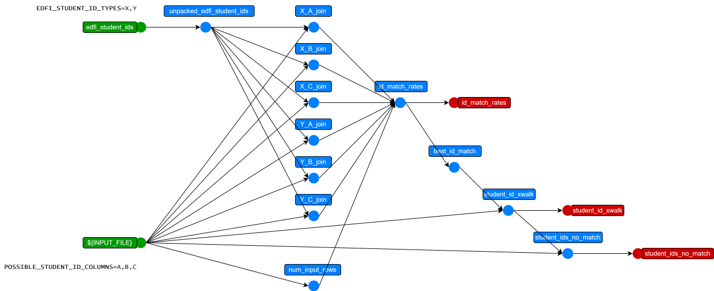

This folder contains several packages for aligning student IDs from source data with known IDs from EdFi.

## Usage

Assuming you have an earthmover project which uses an assessment bundle, such as
```yaml
packages:
  NWEA_Map:
    git: https://github.com/edanalytics/earthmover_edfi_bundles.git
    subdirectory: assessments/NWEA_Map
```
and the required configuration for the assessment bundle (`INPUT_FILE`, etc.), you can use these student ID crosswalking packages as follows:

The first time you see an assessment file, compute the `best_id_match_rates` by
1. adding the `compute_match_rates` package to your earthmover project:
    ```yaml
    packages:
      compute_match_rates:
        git: https://github.com/edanalytics/earthmover_edfi_bundles.git
        branch: student_id_align
        subdirectory: packages/student_ids/compute_match_rates
    ```
1. providing a source of student IDs known to EdFi as either a query against an [Enable Data Union (EDU)](https://enabledataunion.org/) Ed-Fi data warehouse:
    ```yaml
    sources:
      edfi_roster:
        connection: "snowflake://$SNOWFLAKE_USER:$SNOWFLAKE_PASS@$SNOWFLAKE_ACCOUNT?warehouse=$SNOWFLAKE_WAREHOUSE"
        # This is a Snowflake SQL query which constructs a structure like the student ID portion of
        # Ed-Fi studentEducationOrganizationAssociations from EDU warehouse data:
        query: >
          with ids as (
              select
                  tenant_code, api_year, k_student, ed_org_id,
                  object_construct_keep_null('assigningOrganizationIdentificationCode', id_system,
                      'identificationCode', id_code) as stu_id_code,
              from analytics.prod_stage.stg_ef3__stu_ed_org__identification_codes
          ),
          aggd_ids as (
              select
                  tenant_code, api_year, k_student, ed_org_id,
                  array_agg(stu_id_code) as stu_id_codes
              from ids group by 1,2,3,4
          )
          select
              object_construct('educationOrganizationId', ed_org_id,
              'link', object_construct(
                  'rel', 'LocalEducationAgency')) as "educationOrganizationReference",
              object_construct('studentUniqueId', stu.student_unique_id) as "studentReference",
              stu_id_codes as "studentIdentificationCodes"
          from aggd_ids
              join analytics.prod_stage.stg_ef3__students stu on aggd_ids.k_student=stu.k_student
          where aggd_ids.tenant_code='some_tenant' -- UPDATE THIS!
              and aggd_ids.api_year=2025           -- UPDATE THIS!
    ```
    or the result of
    ```sh
    lightbeam fetch -s studentEducationOrganizationAssociations -k studentIdentificationCodes,educationOrganizationReference,studentReference
    ```
    (see [lightbeam](https://github.com/edanalytics/lightbeam) documentation) as
    ```yaml
      edfi_roster:
        file: ./studentEducationOrganizationAssociations.jsonl
    ```
1. specifying the list of column names from your INPUT_FILE which *may contain* student IDs via an environment variable called `POSSIBLE_STUDENT_ID_COLUMNS` (for example `POSSIBLE_STUDENT_ID_COLUMNS=School_StateID,StudentID,Student_StateID`)
1. specifying the possible values of `studentIdentificationCodes.assigningOrganizationIdentificationCode` in EdFi via an environment variable called `EDFI_STUDENT_ID_TYPES` (for example `EDFI_STUDENT_ID_TYPES=Local,District,State`)
1. specifying the assessment file source node with student IDs via an environment variable called `EARTHMOVER_NODE_TO_XWALK` (for example `EARTHMOVER_NODE_TO_XWALK=\$sources.nwea_map_input`)
1. executing `earthmover run -s student_id_match_rates` to produce `student_id_match_rates.csv` (save this file)

Example:
```bash
earthmover run -s student_id_match_rates -p '{
"POSSIBLE_STUDENT_ID_COLUMNS":"School_StateID,StudentID,Student_StateID",
"EDFI_STUDENT_ID_TYPES":"Local,District,State",
"EARTHMOVER_NODE_TO_XWALK":"$sources.nwea_map_input",
"BUNDLE_DIR":"./",
"INPUT_FILE":"path/to/file.csv"}'
```

Once you have computed the `student_id_match_rates.csv`, you can use (and re-use) that information to cross-walk student IDs in subsequent assessment files by
1. adding the `apply_xwalk` package to your earthmover project:
```yaml
packages:
  apply_xwalk:
    git: https://github.com/edanalytics/earthmover_edfi_bundles.git
    branch: student_id_align
    subdirectory: packages/student_ids/apply_xwalk
```
1. specify the minimum required match rate `REQUIRED_MATCH_RATE` (for example `REQUIRED_MATCH_RATE=0.5`) to make the process exit if no pair of IDs with sufficient match rate is found

This results in a node `$transformations.input_xwalked` (identical to `EARTHMOVER_NODE_TO_XWALK` but with an added column `edFi_studentUniqueID`) which you can swap back into the assessment bundle via an override such as
```yaml
transformations:
  nwea_map_student_assessment:
    source: $transformations.input_xwalked
```

Example:
```bash
earthmover run -p '{
"EARTHMOVER_NODE_TO_XWALK":"$sources.nwea_map_input",
"REQUIRED_MATCH_RATE":0.5,
"EDFI_STUDENT_ID_TYPES":"Local,District,State",
"BUNDLE_DIR":"./",
"INPUT_FILE":"path/to/file2.csv"}'
```


## Design

The `compute_match_rates` package works by
* computing a join on every possible combination of `POSSIBLE_STUDENT_ID_COLUMNS` and `EDFI_STUDENT_ID_TYPES`
* choosing the combination with the best match rate
* producing `best_id_match_rates.csv` which can be used by the `apply_xwalk` package
* also producing `input_no_student_id_match.csv`, which is the `INPUT_FILE`'s row that *did not match* any Ed-Fi student ID

Below is a picture of the sort of graph this bundle produces and runs:



