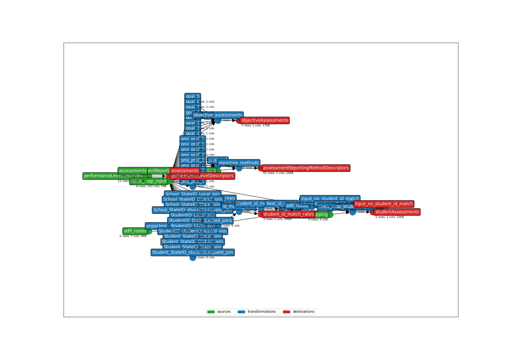
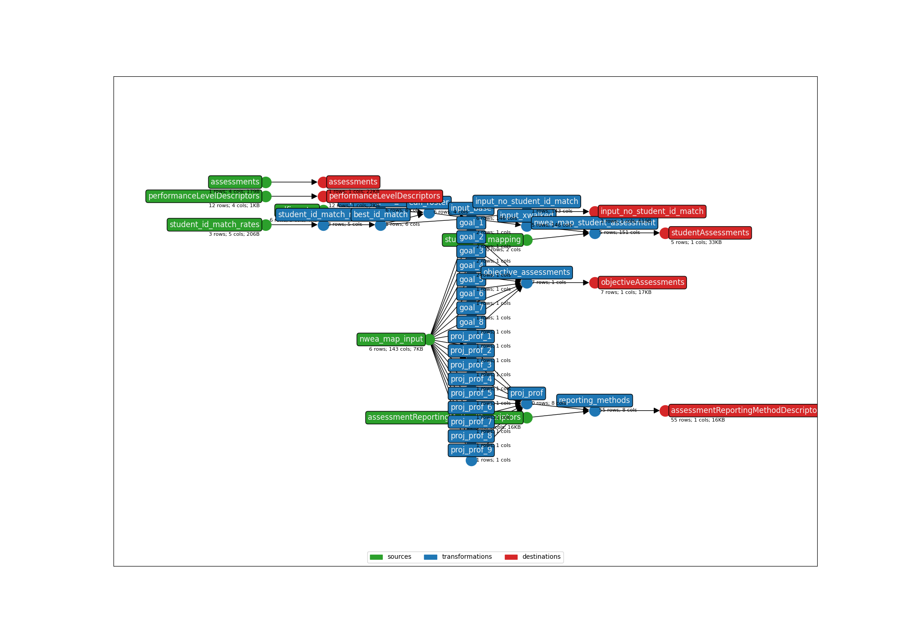

This is an earthmover project showing how to combine the NWEA Map assessment bundle with the student ID xwalk bundle using project composition.

On the first run, calculate and output the best student ID match rates (they will materialize at `output/student_id_match_rates.csv`) by running:
```bash
earthmover run -p '{
"BUNDLE_DIR": ".",
"INPUT_FILE": "./FakeAssessmentFile.csv",
"REQUIRED_MATCH_RATE":0.5,
"POSSIBLE_STUDENT_ID_COLUMNS": "School_StateID,StudentID,Student_StateID",
"EDFI_STUDENT_ID_TYPES": "Local,District,State",
"EDFI_ROSTER_SOURCE_TYPE": "file",
"EDFI_ROSTER_FILE": "./studentEducationOrganizationAssociations.jsonl",
"MATCH_RATES_SOURCE_TYPE": "none",
"EARTHMOVER_NODE_TO_XWALK": "$sources.nwea_map_input",
"OUTPUT_DIR": "./output/"
}'
```

This executes a transformation graph like:

Note the lower section of blue, which joins every pair of ID types to determine which pair has the best match rate. `student_id_match_rates.csv` is also output.

On subsequent runs, xwalk student IDs using the (prevously-computed) match rate and produce Ed-Fi JSONL files by running:
```bash
earthmover run -p '{
"BUNDLE_DIR": ".",
"INPUT_FILE": "./FakeAssessmentFile.csv",
"POSSIBLE_STUDENT_ID_COLUMNS": "School_StateID,StudentID,Student_StateID",
"EDFI_STUDENT_ID_TYPES": "Local,District,State",
"EDFI_ROSTER_SOURCE_TYPE": "file",
"EDFI_ROSTER_FILE": "./studentEducationOrganizationAssociations.jsonl",
"MATCH_RATES_SOURCE_TYPE": "file",
"MATCH_RATES_FILE": "./output/student_id_match_rates.csv",
"EARTHMOVER_NODE_TO_XWALK": "$sources.nwea_map_input",
"OUTPUT_DIR": "./output/"
}'
```

This executes a transformation graph like:

Note that this time we don't have to recompute the ID match rates, since they're supplied via the `MATCH_RATES_FILE`.

The possible configuration options are:
* `INPUT_FILE` the (main) input file to process
* `POSSIBLE_STUDENT_ID_COLUMNS`: a comma-separated list of columns from the `INPUT_FILE` that might contain student IDs
* `EDFI_STUDENT_ID_TYPES`: a comma-separated list of ID types from your Ed-Fi roster
* `EARTHMOVER_NODE_TO_XWALK`: the assessment bundle's node to which to apply the xwalked input file (this will soon be deprecated in favor of the standardized node name `$sources.input` across all assessment bundles)
* `BUNDLE_DIR`: the relative directory of the assessment bundle (this will soon be deprecated)
* `OUTPUT_DIR`: the directory to which to write earthmover output files
* `ASSESSMENT_BUNDLE`: which assessment bundle to install and run
* `MATCH_RATES_SOURCE`: (for not-the-first runs) the match rates between pairs of ID types computed on the first run... either a CSV file such as `./output/student_id_match_rates.csv` or a Snowflake database, schema, and table such as `SNOWFLAKE:somedb.someschema.student_id_match_rates`
* `EDFI_ROSTER_SOURCE`: where to get the Ed-Fi student ID roster from... either a path to a JSONL file such as `./studentEducationOrganizationAssociations.jsonl` or a Snowflake database and schema such as `SNOWFLAKE:analytics.prod_stage`
* `SNOWFLAKE_TENANT_CODE`: if `EDFI_ROSTER_SOURCE` is Snowflake, the `tenant_code` by which to filter
* `SNOWFLAKE_SCHOOL_YEAR`: if `EDFI_ROSTER_SOURCE` is Snowflake, the `api_year` by which to filter
* `REQUIRED_MATCH_RATE`: the minimum match rate required to proceed (if no pair of ID types with at least this match rate is found, earthmover will exit)

If you use Snowflake for either `EDFI_ROSTER_SOURCE` or `MATCH_RATES_SOURCE`, you must also set `SNOWFLAKE_USER`, `SNOWFLAKE_PASS`, `SNOWFLAKE_ACCOUNT`, and `SNOWFLAKE_WAREHOUSE` (these are used by the `edfi_roster` bundle).